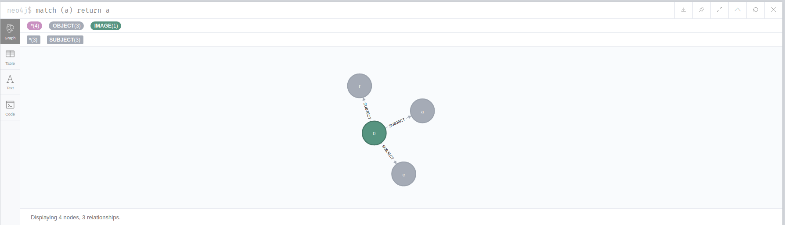

# docker_datalake
Docker POC for datalake : neOCampus internship for 2nd year of Master in Statistic and Decisional Computing (SID at Université Toulouse 3 - Paul-Sabatier in Toulouse)
# Context :
NeOCampus is an operation based in the University with numerous research laboratory. A big part of the network used in this operation is used by sensors and effector. But we can find a lot of other kind of informations. The goal of this project is to create an architecture of data lake that can handle the needs and the data in neOCampus operation.

## Architecture (it might change in the future) : 

## Activity Diagram : 
### Data lake

### Data integration activity diagram (Apache Airflow) : 

# Composition and TODO part: 
The architecture is defined by big 3 parts : 

- [x]  Input part : the first area of the data lake that handle raw input data 
    - [ ] API Rest 
        - [x] Make available the data input
        - [ ] API Rest to input 1 or more data
    - [x] Object storage : Openstack swift 
        - [x] Unittest : OK 
        - [x] Functionaltest : OK 
            - Ran: 950 tests in 571.0000 sec.
                - Passed: 883
                - Skipped: 67
                - Expected Fail: 0
                - Unexpected Success: 0
                - Failed: 0
                - Sum of execute time for each test: 502.9311 sec.
        - [ ] Keystone as authentication service
        - [ ] Other Openstack services 
    - [x] MongoDb database for metadata
    - [x] Trigger for new input to launch a new Airflow job
        - [x] Create middleware for swift proxy (Webhook trigger to launch Airflow jobs)
        - [ ] Optimizations 
- [x]  The "Work zone" : Every jobs to transforms data
    - [x] Airflow deployment (docker image) 
        - [x] Docker image 
        - [x] Installation on VM
        - [ ] Ressources optimization 
            - [ ] Celery executor
            - [ ] Hadoop for jobs
    - [x] Airflow job creation / configuration 
        - [x] Handle hook from Swift middleware (Webhook)
        - [x] Set up jobs 
        - [ ] Handle big file (split big file reading + processing if possible)
- [x] The "gold" zone : database to store formatted / valuable data
    - [ ] Relational database (default)
    - [x] Time serie oriented database (visualisation)
        - [x] Json data :
            - [x] Based on templates given (as an input in metadatabase)
    - [x] Document oriented database (transactional vision)
    - [x] Graph database 
        - [x] Image files : 
            - [x] Jpeg 
                - [x] Nodes creation for objects in the file
                - [ ] Automatic object detection / segmentation 
        - [ ] Recommendation tool  
    - [ ] ...

- [x] Set up a "log" database to log operations on data done
    - Operations are logged in MongoDB MetaDataBase : successful and failed operation (Airflow task + id ) + operations per day
- [ ] Diagrams for 
    - [x] Software Architecture
        - [x] Basic
        - [ ] Advanced
    - [ ] Hardware Architecture
        - [ ] Basic 
    - [ ] Sequence diagram
        - [x] Basic
        - [ ] Advanced
# What services are available now : 
#### Services : 

| |Swift | Metadata `MongoDB` | Airflow |Airflow `Jobs` | Neo4J `"Gold" zone`|InfluxDB`"Gold" zone`|Mongodb`"Gold" zone`  
|:-----:|:----------:|:----------:|:--:|:--:|:--:|:-:|:-:| 
Todo |  | |||| | |
Working||||||||
Production state||||||||
Optimized||||||||  
Production state|||| ||||

  
All is installed on Osirim : need to be tested.
### Data model :   

| |Image : JPEG | Image : PNG | Text : Json |  
|:---:|:---:|:----:|:---:|  
|Available|| ||
###### Neo4j data format example :

# How to run : 
- docker-compose up 

If you want to insert data in the datalake (a file) : use the "insert_datalake()" function in  ["python_test_script.py"](./python_test_script.py) 
 

## Tools : 

- MongoDb
- Openstack Swift
- Apache Airflow 
- Neo4J
- Influxdb

Aiflow DAG tools in the apache_airflow/dag/lib folder has a special nomenclature : 
- *tools : all the tools from a database or to process a specific data type 
- *integrator : implemented tool to put data into a specific database 

## Not used : 

##### In the input area :
-  HBase : need for raw input data, HBase would have been used as a key / value database while it's a column store database + difficult to handle raw data reading

#### For the raw-to-formatted data transformer : 
-  Talend : difficulties to install on Linux + difficulties to find version that can be integrated in the POC

#### For the "Gold" zone : 
- ... 

## How to go further :
- [ ] Job creation automatization for Airflow 
    - Create automatically the job for new data format and the output format
        - Allow us to integrate every kind of data without human action 
- [ ] Ensure that input into Swift and MongoDB is an atomic operation (and if one fail, the other fail)
    - How ? : May not be possible
    - [ ] Solution : Set up a mechanism that check if data are well stored  
- [x] Handle the input of same data (redundant data)
    - [x] Done natively in Swift : all datas are stored even if they already are in the database
    - [ ] Set up a mechanism to handle redundant datas