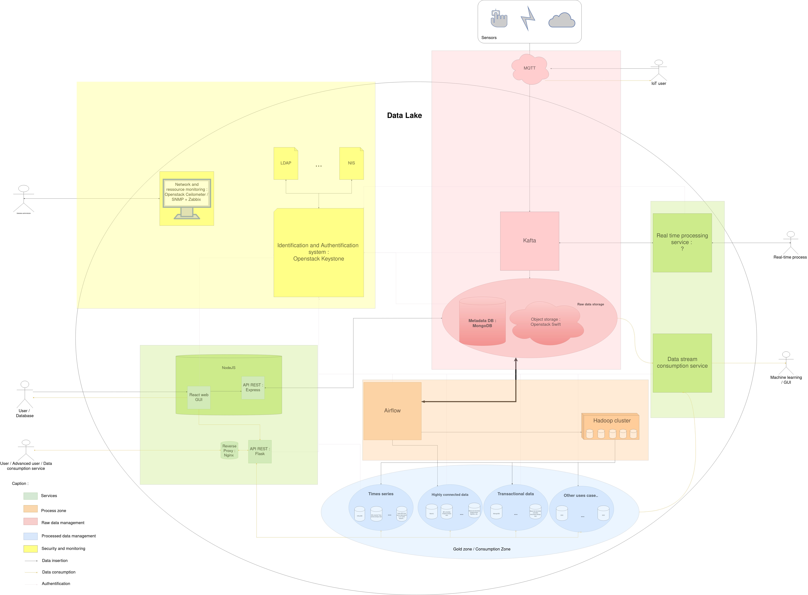
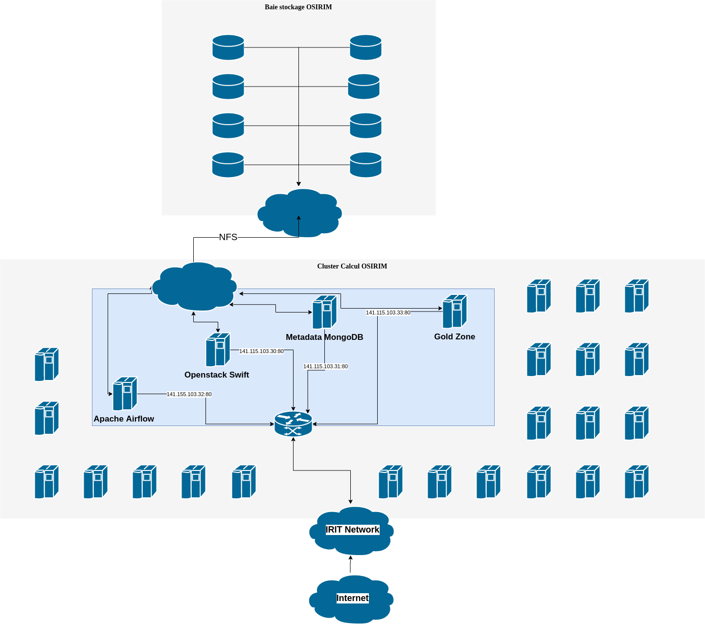
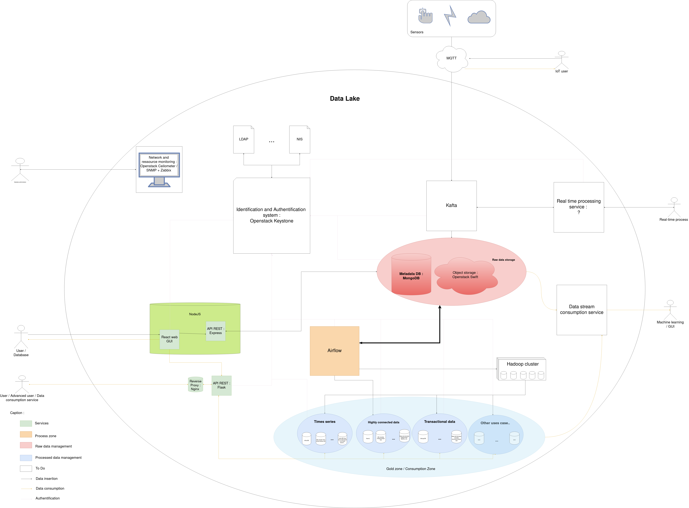

# Data lake architecture POC hosted on OSIRIM (https://osirim.irit.fr/site/)

This repository is the main working repository for the data lake architecture.
The goals are : 
- Create an opensource architecture for data management based on data lake architecture
- Handle any type of data 
- Handle any volumetry of datas
- Make it easy to deploy the architecture
- Make an interoperable architecture through the usage of REST API whenever it is possible

## Table of content 
- [The project](#Context)
    * [Concept](#Concept)
    * [Current architecture](#Currentarchitecture)
    * [Areas Description](#AreasDescription)
        + [Raw data management area / landing area](#Rawdatamanagementareaorlandingarea)
        + [Process area](#Processarea)
        + [Consumption zone or processed data area or gold zone](#Consumptionzoneorprocesseddataareaorgoldzone)
        + [Services area](#Servicesarea)
        + [Security and monitoring area](#Securityandmonitoringarea )
    * [Services available](#Servicesavailable)
    * [Tools used](#Toolsused)
    * [Diagrams](#Diagrams)
        + [Activity Diagram](#ActivityDiagram)
        + [Data integration activity diagram for Apache Airflow](#DataintegrationactivitydiagramforApacheAirflow)
    * [How to](#Howto)
        + [Insert a new data](#Insertanewdata)
        + [Process a data already inserted](#Processadataalreadyinserted)
        + [Access to services - TODO](#Accesstoservices)
            - [TCP Ports used](#TCPPortsused)
            - [API description - TODO](#APIdescrption)
        + [Deploy the architecture](#Deploythearchitecture)
        + [Create an Airflow job](#CreateanAirflowjob)
        + [Create an Airflow pipeline](#CreateanAirflowpipeline)
        + [Integrate a new process pipeline in Airflow](#IntegrateanewprocesspipelineinAirflow)
            - [Problems already encountered](#Problemsalreadyencountered)
    * [Data formats in](#Dataformatsin)
        + [Openstack Swift](#OpenstackSwift)
        + [MongoDB metadata database - TO REFACTOR](#MongoDBmetadatadatabase)
    + [Data exchanges between services](#Dataexchangesbetweenservices)
- [TODO](#TODO)
    * [Development on the project](#Developmentontheproject)
    * [Development for the project](#Developmentfortheprojet)
        + [Around the architecture](#Aroundthearchitecture)
        + [Documentation](#Documentation)
        + [What to change for a production deployment](#Whattochangeforaproductiondeployment)
        + [How to go further](#Howtogofurther)
            -[Neo4J as image recommendation system](#Neo4Jasimagerecommendationsystem)
- [Other informations](#Otherinformations)
    * [Tools not used](#Toolsnotused)
        + [In the input area](#Intheinputarea)
        + [In process area](#Inprocessarea)
        + [In processed data area](#Inprocesseddataarea)
    * [Start Openstack Swift docker container](#StartOpenstackSwiftdockercontainer)
    * [More documentation](#Moredocumentation)
    * [Licence](#Licence)
- [Contacts](#Contacts)
    

# Context 
[Return to the table of content](#Tableofcontent)

This project is supported by neOCampus, OSIRIM, the CNRS, the IRIT and the SMAC team in IRIT. 

This project has been started with a internship for 2nd year of Master in Statistic and Decisional Computing (SID at Université Toulouse 3 - Paul-Sabatier in Toulouse) funded by neOCampus. 
The project has been continued through a 1year-fixed-term contract by the CNRS and the OSIRIM platform.

- NeOCampus is an operation based in the University with numerous research laboratory. A big part of the network used in this operation is used by sensors and effector. But we can find a lot of other kind of informations. The goal of this project is to create an architecture of data lake that can handle the needs and the data in neOCampus operation.
- OSIRIM (Observatoire des Systèmes d'Indexation et de Recherche d'Information Multimedia) is one of IRIT's platforms. It is mainly supported by the European Regional Development Fund (ERDF), the French government, the Midi-Pyrénées region and the Centre National de la Recherche Scientifique (CNRS).
- The SMAC team is interested in modeling and problem solving in complex systems using multi-agen technology. ( https://www.irit.fr/departement/intelligence-collective-interaction/equipe-smac/ )

# The project 

## Concept 
[Return to the table of content](#Tableofcontent)

Data-oriented project are most of the time driven by the use case. 
Whether it is for employee data storage, for reporting, for anomaly detection, for application operation, etc.., it requires a specific architecture based on a database.

Those kind of architecture needs to be secured, well dimensioned and administered. 
But if another use case is deployed, the whole process has to be done again for each new use case. It costs time and resources (human and server resources).

The data lake allows to share the whole architecture for security, authentication, server allocation services for any kind of data driven project.
Moreover, the solution proposed here allow to integrate any kind of data management, data analysis or reporting solution in a unique solution.

It reduces costs for **high volumetry** and a **high variety** of data project or companies. 
This solution has been designed to integrate solutions that has already been deployed, as authentication systems, database solutions or data analysis solutions. 
The initial resource investment is higher than simple database solution but it is reduced for new other solutions.

## Current architecture 
[Return to the table of content](#Tableofcontent)

The architecture is divided in 5 functional areas :
- Raw data management area (also known as the landing area)
- Process area
- Processed data area (also known as the gold zone)
- Services area
- Security and monitoring area

### Areas description 
[Return to the table of content](#Tableofcontent)

Each area has its own goal : 

#### Raw data management area or landing area 
[Return to the table of content](#Tableofcontent)

The purpose of this area is to handle, store and make available raw data. Each data is stored as is waiting to be processed and transformed into an information.

This area is the core of the architecture, where every data are stored and every service of this architecture are working on. 
This area is composed with 2 services :
- Openstack swift (https://wiki.openstack.org/wiki/Swift) : 
    - Openstack Swift is a cloud storage software. It is an object-oriented store. It is a part of the Openstack cloud platform deployment and has been built for scale and optimized for durability, availability, and concurrency across the entire data set. 
    - Its role is to store all input data as an object. It can handle any type of file or data of any size. 
- MongoDB (https://www.mongodb.com/) :
    - Document oriented NoSQL database. It has been built as a NoSQL database made for high volumetry input. 
    - Its role is to store meta data over the data inserted in Openstack Swift and to make it possible to follow and store data over data and be able to know what is stored in Openstack Swift.

A third service has been integrated in the conception for data stream input :
- Apache Kafka (https://kafka.apache.org/):
    - Apache Kafka is an open-source distributed event streaming platform.
    - Its initial purpose is to handle MQTT message from sensors to raw data management area.
    
#### Process area 
[Return to the table of content](#Tableofcontent)

This area is composed by 1 service that will handle every workflow and jobs of data processing :
- Apache Airflow (https://airflow.apache.org/)
    - Job and workflow scheduler application. This service make it possible to schedule and monitor workflows written in Python.
    - Based on direct acyclic graphs, the data life is easily monitored.
    - It process raw data from the raw data management area to the processed data area by applying custom workflows developed by and for users needs. 

The deployment of a Hadoop cluster has been thought but the idea could be not implemented or kept.

#### Consumption zone or processed data area or gold zone   
[Return to the table of content](#Tableofcontent)

This area is there to create values over data. Its role is to provide information and allow external application to work on data.
The processed data area is supposed to host any database that is needed by users. 
As no real need have been expressed, no real use case are implemented here. 
But some use cases have been imagined :
- InfluxDB (https://www.influxdata.com/):
    - Time serie oriented database with data visualization tools natively integrated.
    - The purpose of this database is to store formatted sensors readings and make it possible to visualize those data easily.
- Neo4J (https://neo4j.com/): 
    - Graph oriented database with data visualization tools natively integrated.
    - The purpose of this database is to store metadata over blob data (image, sound, video) to create a recommendation system for dataset creation.
- MongoDB (https://www.mongodb.com/):
    - Same database as the metadata database used in the raw data management area.
    - The purpose here is to store data for in-production applications
    
#### Services area   
[Return to the table of content](#Tableofcontent)

This functional area includes every service to make this platform user-friendly. At this point (23/11/2020), 3 services have been designed :
- Data insertion and download services :
    - Composed with 2 services : web GUI and REST API.
        - The web GUI is based on NodeJS server with a React application for user-friendly data insertion. The data are inserted or shown through a graphical user interface to make it easy to use.
        - The REST API is developed with python Flask API to make it possible to programmatically use the data management services (insert data in raw data management area or download data from processed data area)
- Real-time data consumption service :
    - No solution have been found at this point (23/11/2020) to answer this need.
    - The purpose of this service is to make it possible to consume data in a real-time process (initially designed for autOCampus project in neOCampus)
- Streaming data consumption service :
    - No solution have been found at this point (23/11/2020) to answer this need.
    - The purpose of this service is to make it possible to consume data as a stream for application that works in streaming mode. It has been initialy designed for online machine learning application. 

#### Security and monitoring area    
[Return to the table of content](#Tableofcontent)

The purpose of this area is to make it possible to monitor the whole architecture for administrators and give 3 level monitoring.
The area has to be adapted to the host platform so services could change with deployment.
- First monitoring level : User level
    - Openstack Keystone (https://wiki.openstack.org/wiki/Keystone)
        - This service is here to identify and authenticate users in the architecture.
        - It integrate itself well with Openstack Swift and over other authentication services as LDAP or NIS that allow to maintain pre-existing authentication services. 
- Second monitoring level : Service level
    - Openstack Ceilometer (https://docs.openstack.org/ceilometer/latest/):
        - This service is a telemetry service for Openstack services. 
        - The objective is to monitor services state and usages for sizing in operation.
- Third level : Network and system level
    - SNMP + Zabbix : 
        - SNMP is a standard protocol of network management. It allow us to follow machine resources consumption and network usage.
        - Combine with Zabbix, this is a service of network and system monitoring with graphical user interface.

This area has to be work more to better design it. Prometheus could be used to monitor Network and System level and other services could be used for other levels. 

### Services available  
[Return to the table of content](#Tableofcontent)

TODO : Refactor and update -> new data analysis and new horizons are set

| |Swift | Metadata `MongoDB` | Airflow |Airflow `Jobs` | Neo4J `"Gold" zone`|InfluxDB`"Gold" zone`|Mongodb`"Gold" zone`  
|:-----:|:----------:|:----------:|:--:|:--:|:--:|:-:|:-:| 
Todo |  | |||| | |
Working||||||||

  
All is installed on Osirim : need to be tested.

### Tools used 
[Return to the table of content](#Tableofcontent)

- MongoDb
- Openstack Swift
- Apache Airflow 
- Neo4J
- Influxdb
- NodeJS
- React
- Flask

Aiflow DAG tools in the apache_airflow/dag/lib folder has a special nomenclature : 
- *tools : all the tools from a database or to process a specific data type 
- *integrator : implemented tool to put data into a specific database 

## Diagrams 
### Activity diagram  
[Return to the table of content](#Tableofcontent)

The data life in this architecture is described in this diagram : 

- First, data are inserted simultaneously in Openstack Swift and MongoDB meta database.
- Then, a webhook is triggered by swift proxy to trigger the Airflow workflow for new data containing metadata over the data inserted.
- Depending on the data type, the user and the user group / project, the data is processed, transformed and inserted in the corresponding database in the processed data area. 
- Every operations are logged in the metadata database.
 
### Data integration activity diagram for Apache Airflow 
[Return to the table of content](#Tableofcontent)

The Proof of Concept hosted on Osirim is hosted on several VM.
Each service has its own virtual machine. 
Data storage is made on a NFS bay. At this point (23/11/2020), the POC is not adapted for this platform and wont be deployed in a production state on OSIRIM.
## How to 
### Insert a new data 
[Return to the table of content](#Tableofcontent)

To develop a tool to insert data in the datalake, you have to :
- Get the Swift ID counter and increase it (use "find_one_and_update" to do it with the same operation and reduce chances of data incoherence between 2 instances)
- Construct metadata to store in mongodb (JSON or Python dictionary)
    - content_type : MIME type of the data 
    - swift_user : the swift user that inserted the data
    - swift_container : the swift container where the data is stored
    - swift_object_id : the swift ID given to the data when it has been inserted
    - application : a description of the data usage : the application on which the data is used (optional)
    - swift_object_name : the name of the data (the original name)
    - creation_date : creation date of the document 
    - last_modified : date of the last document modification (and get the last operation date)
    - successful_operations : list of successful operations containing (tuple) :
        - execution_date : 
        - dag_id : The string of "dag_run" instance containing some informing as the dag_id (ex : <DagRun new_input @ 2020-08-04 14:42:38+00:00: 
        test:tester_neocampus_119:2020-08-04T14:42:38, externally triggered: True>") :
            - If the task has been triggered by the proxy-server trigger, it contains :
                - "manual"
                - the date=
            - If the task has been triggered by the "Check_data_to_process" dag, it contains ("%s_%s_%s:%s"): 
                - the user
                - the container
                - the data swift id
                - the date (datetime)
        - operation_instance : The task id (same format as the dag_id)
    - failed_operations : list of failed operations containing the same as in "successful_operations"
    - other_data : every data that are useful : dictionary 
        - For JSON (jsontools.mongodoc_to_influx()):   
            - template : dictionary for Influxdb to know what field in the json is for : 
                - measurement : str
                - time : datetime 
                - fields : list of couple (key:str ,value : Any)
                - tags : list of couple (key:str ,value: Any)
        - For image JPEG / PNG (neo4jintegrator.insert_image()) : 
            - image_content : every object that are in the image
                - main_object : the main objects in the image
                - secondary_object : object you can see in image in background 
- Check if the swift container exists. If not, creates it.
- Put the data in Swift (with content_type and the swift_id)
- Put the metadata in MongoDB

The "python_test_script.py" is a example script made to add a new data. It has been done to do test but it can be reused to make an insertion script or a REST API.

### Process a data already inserted 
[Return to the table of content](#Tableofcontent)

There is a document in "stats" database in "swift" collection in MongoDB that contains list of data to process that will be check every 5 minutes by "Check_data_to_process" dag. Adding a swift
You'll have to add a document in this list containing : 
- swift_id 
- swift_container
- swift_user
- content_type 

For each data in this list, it will trigger a "new_input" dag to process this data.
DISCLAIMER : "new_input" is actually disable for testing. The actual pipeline is "test" until integration of new pipeline has been done.

### Access to services  

#### TCP Ports used  
[Return to the table of content](#Tableofcontent)

Raw data area : 
- 8080 : Swift 
- 27017 : MongoDB metadatabase

Process zone : 
- 8081 : Airflow (Webserver)

Consumption zone : 
- Influxdb ports depends on InfluxDB version used (InfluxDB 2 beta version or RC version)  
    - 9999 : InfluxDB web interface  
    - 8086 : Influxdb web interface

- 7000 :Neo4J
#### API descrption 
[Return to the table of content](#Tableofcontent)

TODO : Openstack, MongoDB, API Rest for insertion, web gui, etc..
Openstack Swift : REST API (see documentation)
MongoDB : API in several languages (Pymongo in Python as an example)
Airflow : Web server GUI and REST API (see documentation)

### Deploy the architecture 
[Return to the table of content](#Tableofcontent)

TODO : Finish ansible, make fully automatic deployment with ansible (see docker branch) 
- docker-compose up 

If you want to insert data in the datalake (a file) : use the "insert_datalake()" function in  ["python_test_script.py"](./python_test_script.py) 

### Create an Airflow job 
[Return to the table of content](#Tableofcontent)
Jobs (or tasks) are done through Operators in Airflow (https://airflow.apache.org/docs/apache-airflow/1.10.14/concepts.html#concepts-operators). The definition of a job or a task is done through a python script.
To create a task that will fit in one or more pipeline, an operator has to be used which are defined in the Airflow package.
Several operators exists and each one is used for a specific use, including : 
- BashOperator - executes a bash command
- PythonOperator - calls an arbitrary Python function
- EmailOperator - sends an email
- SimpleHttpOperator - sends an HTTP request
- MySqlOperator, SqliteOperator, PostgresOperator, MsSqlOperator, OracleOperator, JdbcOperator, etc. - executes a SQL command
- Sensor - an Operator that waits (polls) for a certain time, file, database row, S3 key, etc…
In addition to these basic building blocks, there are many more specific operators: DockerOperator, HiveOperator, S3FileTransformOperator, PrestoToMySqlTransfer, SlackAPIOperator…
(Cf. Airflow documentation)

The python operator may be the most useful. To use it, there are 2 steps to follow : 
- First, create the python function to be done by the task, example : 

<b></b>

    def print_context(ds, **kwargs):
    print(ds)
    return 'Whatever you return gets printed in the logs'
    
- Then, define an operator that will run this function. You have to define the DAG (Directed Acyclic Graph) in which the task will be run but each function can be reused in another Operator.

<b></b>

    run_this = PythonOperator(
        task_id='print_the_context',
        provide_context=True,
        python_callable=print_context,
        dag=dag,
    )

A context can be provided with PythonOperator (always provided in version 2.0) that will allow to give arguments to the function through the **kwargs dict. You can use it as a dictionary and create new keys to provide the data you need. 
This dictionary contains already a lot of information over the dag run (date, id, etc...) but also contains a "ti" or a "task_instance" (depends on .. ?) key that contains the XCom (for cross-communication) object that allow to pull and push information or objects.
- You can push data to pass it to another task 

<b></b>
        
    kwargs['task_instance'].xcom_push(key="thekey",value="thevalue"))
<b>OR </b>

    kwargs["key"] = value
    
- You can pull data from previous task from its return or from a xcom_pull() 

<b></b>

    
    kwargs['task_instance'].xcom_pull(task_ids='ID_OF_THE_TASK') 
<b>OR </b>

    kwargs['ti'].xcom_pull(task_ids='ID_OF_THE_TASK')

Look at the documentation for more information (https://airflow.apache.org/docs/apache-airflow/1.10.14/).

### Create an Airflow pipeline 
[Return to the table of content](#Tableofcontent)

Airflow is based on DAG (Directed Acyclic Graph) to implement pipeline / workflows (http://airflow.apache.org/docs/apache-airflow/1.10.14/concepts.html#dags). The definition of a pipeline / workflow is done through a python script
The definition of a pipeline is quite straight forward :
- Define a DAG object 

<b></b>
    
    default_args = {
        'start_date': datetime(2016, 1, 1),
        'owner': 'airflow'
    }
    
    dag = DAG('my_dag', default_args=default_args)

The DAG can be customized with parameters.

- Define the relation between task in your dags.

<b></b>    
    
    task_1 = DummyOperator('task_1', dag=dag)
    task_2 = DummyOperator('task_2', dag=dag)
    task_1 >> task_2 # Define dependencies

The "task_2" will be linked to "task_1" and will be run after it. Each task can be define with a run condition (as "all_success", "all_failed", "at least 1 task is successful", etc..).
It is possible to create several branches to make several way for processing. The tools used for it are branching operators (see https://airflow.apache.org/docs/apache-airflow/1.10.14/concepts.html#branching)
Branching is done the same way but you can link a list of task to branch it. The branching will have to return the task name of the next task to run.

    
    branch_operator >> [way_1 , way_2] 

### Integrate a new process pipeline in Airflow  
[Return to the table of content](#Tableofcontent)

04/01/2021 : 
Right now, it is not possible to easily add a pipeline or a task in Airflow.
The way to do it is to change the actual working pipeline. Indeed, only one is triggered by the Openstack Swift proxy when a new data is added. 

To add a task or a sub-pipeline / sub-workflow, it will be needed to modify the "./apache_airflow/dags/dag_creator.py" (at the end of the script) and modify the "custom path" in the dag:

    custom >> [the_first_task_of_the_sub_pipeline]
    the_first_task_of_the_sub_pipeline >> ... >> join
    
TODO : Add a way to read and parse files in directory and create jobs and dags in function of the content.

For the implementation on OSIRIM, as access are restricted, the best way to add pipeline is to create a python script with : 
- all the functions and the task with operators written in the same file
- create a dummy DAG (optional)
- link all the task (eventually with branching)  

The new pipeline will be added in the "custom" branch as a new way.
Tasks have to be named but 2 tasks have to have different name. The naming convention will be : 

    PROJECT_USER_TASKNAME

with PROJECT the name of the project or the team in which you work in / with, USER is your username, 
TASKNAME is a string that quickly describe the task (example : data_cleaning, feature_extraction, etc...).
It will be easy and fast to integrate the new pipeline.
  
#### Problems already encountered 
[Return to the table of content](#Tableofcontent)

Dont name your task the same name of the callable : it will lead to an error
    
## Data formats in 
[Return to the table of content](#Tableofcontent)

### Openstack Swift  
[Return to the table of content](#Tableofcontent)

Object inserted in Openstack swift are renamed with a number id. 
This id is incremented by 1 for every object insert. It allows to follow easily the number of object stored in Openstack Swift.

Only the renamed data are store in Openstack swift. Every metadata are stored in the metadata database (MongoDB).
Each object is stored on a container that match to the project or the user group / team.
### MongoDB metadata database  
[Return to the table of content](#Tableofcontent)

(23/11/2020) The metadata database is designed in several parts :
- "stats" database :
    - "swift" collection : 
        - contains only 1 document : 
            - { "_id" : ..., "type" : "object_id_file", "object_id" : last_available_swift_id }
            - used to rename and follow Swift object id
        - could be used to store other data
- "swift" database :
    - a collection for each project has to be created :
        - contains 1 document for each object. Each document contains : 
            - "_id" : MongoDB default ID , 
            - "content_type" : type of data / MIME type ,
            - "data_processing" : type of data processing in Airflow ("custom" or "default") for pipeline choosing,
            - "swift_user" : authenticated user that inserted the data, 
            - "swift_container" : Openstack Swift container referring to project / user group,
            - "swift_object_id" : id from "object_id_file" in stats database,
            - "application" : description of the purpose of the data,
            - "original_object_name" : original name ,
            - "creation_date" : ISODate("..."),
            - "last_modified" : ISODate("..."),
            - "successful_operations" : [ ] : list of successful operations done on the data,
            - "failed_operations" : [ ] : list of failed operations done on the data, 
            - "other_data" : {...} : anything that is needed to know on the data (custom metadata inserted by user) 
                     

## Data exchanges between services 
[Return to the table of content](#Tableofcontent)

Data exchanges at this point are described in the following schema.

# TODO  
[Return to the table of content](#Tableofcontent)

(23/11/2020) At this point, the architecture development is described in this diagram

## Development on the project  
TODO list for the project development (i.e. the datalake architecture)
TODO : Update TODO list
- [x]  Raw data mangement area : 
    - [x] Batch mode for data insertion
        - [x] API Rest 
            - [x] Make available the data input
            - [X] API Rest to input 1 or more data
        - [x] Object storage : Openstack swift 
            - [x] Unittest : OK 
            - [x] Functionaltest : OK 
                - Ran: 950 tests in 571.0000 sec.
                    - Passed: 883
                    - Skipped: 67
                    - Expected Fail: 0
                    - Unexpected Success: 0
                    - Failed: 0
                    - Sum of execute time for each test: 502.9311 sec.
            - [ ] Keystone as authentication service
            - [ ] Other Openstack services 
        - [x] MongoDb database for metadata
            - [ ] Replication for single point of failure problem (REALLY IMPORTANT ! -> if MongoDB datas are corrupted, all data in the datalake are useless)  
        - [x] Trigger for new input to launch a new Airflow job
            - [x] Create middleware for swift proxy (Webhook trigger to launch Airflow jobs)
            - [ ] Use X-Webhook in Swift (secure way)
            - [ ] Optimizations 
    - [ ] Streaming mode for data insertion
        - [ ] Kafta integration
- [x]  The process area
    - [ ] Upgrade to version 2.0 (stable) if possible
    - [x] Airflow deployment (docker image) 
        - [x] Docker image 
        - [x] Installation on VM
        - [ ] Resources optimization 
            - [ ] Celery executor
            - [ ] Hadoop for jobs
    - [x] Airflow job creation / configuration 
        - [x] Handle hook from Swift middleware (Webhook)
        - [x] Set up jobs 
        - [ ] Handle big file (split big file reading + processing if possible)
    - [ ] Find a proper way to add new task / pipeline ( dag from JSON file ?) 
- [x] The processed data area / the gold zone : 
    - [ ] Relational database (default)
    - [x] Time serie oriented database (visualisation)
        - [x] Json data :
            - [x] Based on templates given (as an input in metadatabase) 
            - [ ] Improve done work
    - [x] Document oriented database (transactional vision)
    - [x] Graph database 
        - [x] Image files : 
            - [x] Jpeg 
                - [x] Nodes creation for objects in the file
                - [ ] Automatic object detection / segmentation 
        - [ ] Recommendation tool  
    - [ ] ...
- [x] The services area : 
    - [x] RESTFUL API for data insertion and download
        - [x] Python api with Flask 
            - [x] Insertion
            - [x] Download data from database in processed data area
            - [ ] Download data from raw data management area
        - [ ] Improve implementation
    - [x] Web GUI for data insertion and data visualization
        - [x] Dashboard creation
        - [x] Data download with React + Express backend server
            - [x] Drag'n'drop insertion 
            - [x] Progress bar
            - [ ] Handle SLO Openstack Swift insertion (Static Large Object) for > 1 Go files
        - [x] Data visualization with React + D3.JS
            - [x] Basic time series visualization
            - [x] Basic graph visualization
            - [ ] Complex visualization from several different databases
        - [ ] Beautiful dashboard development
    - [ ] Real-time data consumption
    - [ ] Streaming data consumption
- [ ] Security and monitoring area : 
    - [ ] Design the whole area 
    - [ ] Deploy area 
- [x] Set up a "log" database to log operations on data done
    - [x] Operations are logged in MongoDB MetaDataBase : successful and failed operation (Airflow task + id ) + operations per day

## Development for the projet 
### Around the architecture  
[Return to the table of content](#Tableofcontent)

- [ ] Add metadata over transformed data in the goldzone (and be able to find the list of process done to create this processed data)
- [ ] Automatic deployment : Docker + Kubernetes + Ansible
- [ ] Define a licence (certainly MIT licence) : ask for project supervisors
### Documentation  
[Return to the table of content](#Tableofcontent)

- [ ] Diagrams for 
    - [x] Software Architecture
        - [x] Basic
        - [ ] Advanced
    - [ ] Hardware Architecture
        - [ ] Basic 
    - [ ] Sequence diagram
        - [x] Basic
        - [ ] Advanced

 
### What to change for a production deployment 
[Return to the table of content](#Tableofcontent)

For swift : 
- Users authentications :
    - Change the test users 
    - Set up a Keystone service to handle users and authentications
    - Use LDAP (maybe possible ?)
- Size up storage
For MongoDB (metadatabase) :
- Change storage path
For Airflow : 
- Executor : use Celery executor for a better parallisation 
- Handle exceptions more specifically 
For Neo4J (Gold zone) :
- User "neo4j" / mdp "test"
- Change storage path
For InfluxDB (Gold zone) :
- Admin user (user : datalake_admin / password : osirim_datalake_admin)
- Create users
- Change storage path
For MongoDB (Gold Zone) : 
- Listening port  27017 : it will conflicts with the MongoDB metadatabase 
- Change storage path

### How to go further  
[Return to the table of content](#Tableofcontent)

- [ ] Job creation automatization for Airflow 
    - Create automatically the job for new data format and the output format
        - Allow us to integrate every kind of data without human action 
- [ ] Ensure that input into Swift and MongoDB is an atomic operation (and if one fail, the other fail)
    - How ? : May not be possible
    - [ ] Solution : Set up a mechanism that check if data are well stored  
- [x] Handle the input of same data (redundant data)
    - [x] Done natively in Swift : all datas are stored even if they already are in the database
    - [ ] Set up a mechanism to handle redundant datas

#### Neo4J as image recommendation system 
[Return to the table of content](#Tableofcontent)

TODO : Refactor, update and explain

# Other information 

## Tools not used 
[Return to the table of content](#Tableofcontent)

### In the input area 
-  HBase : need for raw input data, HBase would have been used as a key / value database while it's a column store database + difficult to handle raw data reading

### In process area 
-  Talend : difficulties to install on Linux + difficulties to find version that can be integrated in the POC

### In processed data area 
Everything should be possible to be used in this area

### Start Openstack Swift docker container 
[Return to the table of content](#Tableofcontent)

TODO : Refactor, update 

    docker build -f ./swift/Ubuntu1604.Dockerfile -t ubuntuswift ./swift/
    docker run -p 8080:8080 --privileged --device /dev/loop0 --device /dev/loop-control -it ubuntuswift

To make data persistant, use docker volume bind 
    
    docker run -p 8080:8080 --privileged --device /dev/loop0 --device /dev/loop-control -v /tmp/dev:/data_dev/1 -it ubuntuswift

The volumes are mounted in /tmp, you have to use a mountable object : dev or loopbackdevice file.

## More documentation 
[Return to the table of content](#Tableofcontent)

Other markdown files are in folder of each service containing some more information over the service.
A pdf is available in the repository. This pdf contains the internship report that I made for the internship. 
It is mainly made of design thinking.

Tools used in this architecture also have documentation :
- Airflow https://airflow.apache.org/docs/ 
- Openstack Swift  https://wiki.openstack.org/wiki/Swift

## Licence 
[Return to the table of content](#Tableofcontent)

Todo : Apache 2.0 licence ?

### Contacts 
[Return to the table of content](#Tableofcontent)

04/01/2021 : 

DANG Vincent-Nam (Repository owner, intern and engineer working on the project)
Vincent-Nam.Dang@irit.fr / dang.vincentnam@gmail.com 
https://www.linkedin.com/in/vincent-nam-dang/  
