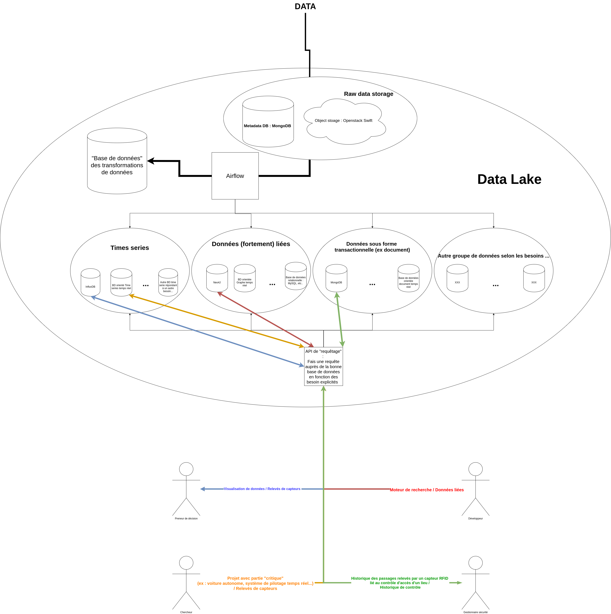
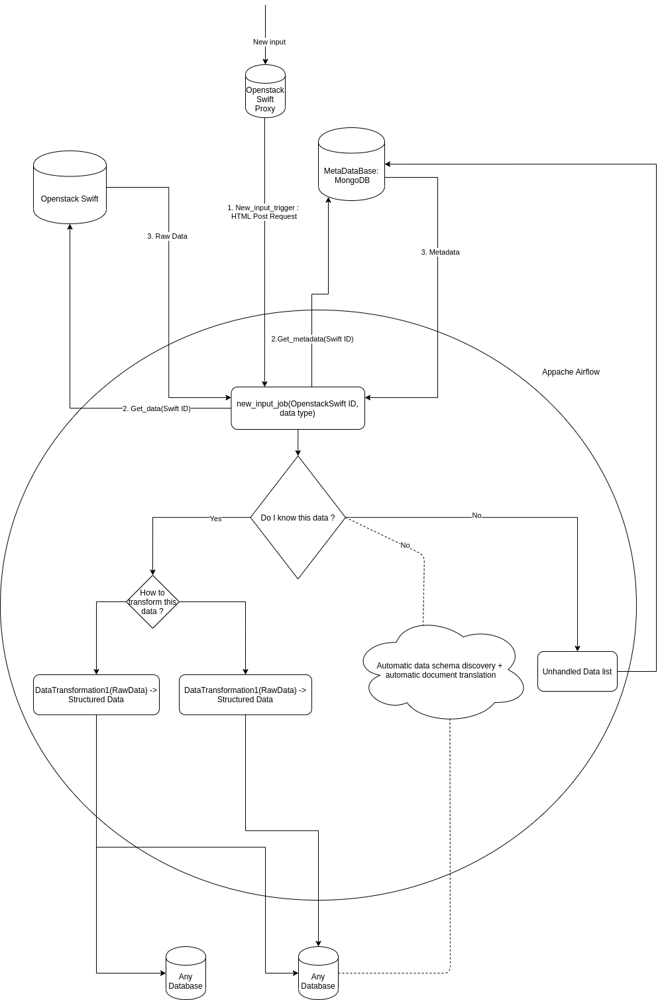
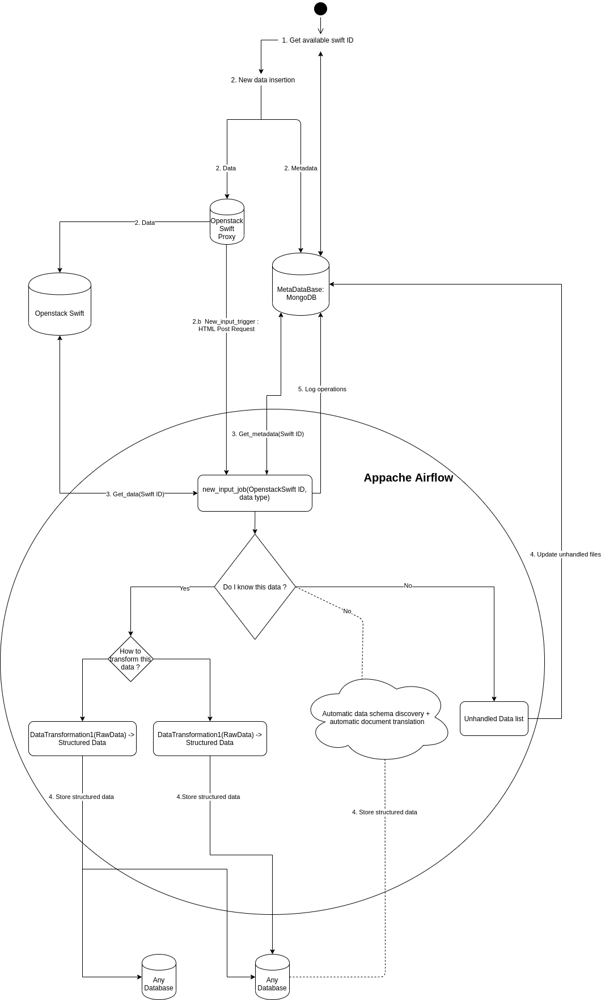

# docker_datalake
Docker POC for datalake : neOCampus internship for 2nd year of Master in Statistic and Decisional Computing (SID at Université Toulouse 3 - Paul-Sabatier in Toulouse)
# Context :
NeOCampus is an operation based in the University with numerous research laboratory. A big part of the network used in this operation is used by sensors and effector. But we can find a lot of other kind of informations. The goal of this project is to create an architecture of data lake that can handle the needs and the data in neOCampus operation.

## Architecture (it might change in the future) : 

## Activity Diagram : 
### Data lake

### Data integration activity diagram (Apache Airflow) : 

# Composition and TODO part: 
The architecture is defined by big 3 parts : 

- [ ]  Input part : the first area of the data lake that handle raw input data 
    - [ ] API Rest 
        - [x] Make available the data input
        - [ ] API Rest to input 1 or more data
    - [x] Object storage
    - [x] MongoDb database for metadata
    - [x] Trigger for new input to launch a new Airflow job
        - [x] Create middleware for swift proxy (Webhook trigger to launch Airflow jobs)
        - [ ] Optimizations 
- [ ]  Transformation from raw to formatted
    - [x] Airflow deployment (docker image) 
    - [ ] Airflow job creation / configuration 
        - [x] Handle hook from Swift middleware (Webhook)
        - [ ] Set up jobs 
- [ ] The "gold" zone : database to store formatted / valuable data
    - [ ] Relational database (default)
    - [ ] Time serie oriented database (visualisation)
    - [ ] Document oriented database (transactional vision)
    - [ ] Graph database (?)
    - [ ] ...
# How to run : 
- docker-compose up 

If you want to insert data in the datalake (a file) : use the "insert_datalake()" function in  ["python_test_script.py"](./python_test_script.py) 

## Tools : 

- MongoDb
- Openstack Swift
- Apache Airflow 

## Not used : 

##### In the input area :
-  HBase : need for raw input data, HBase would have been used as a key / value database while it's a column store database + difficult to handle raw data reading

#### For the raw-to-formatted data transformer : 
-  Talend : difficulties to install on Linux + difficulties to find version that can be integrated in the POC

#### For the "Gold" zone : 
- ... 

## How to go further :
- [ ] Job creation automatization for Airflow 
    - Create automatically the job for new data format and the output format
        - Allow us to integrate every kind of data without human action 
- [ ] Ensure that input into Swift and MongoDB is an atomic operation (and if one fail, the other fail)
    - How ? : Create triggers in MongoDB and Swift to check input request response ?
- [ ] Handle the input of same data (redondant data)