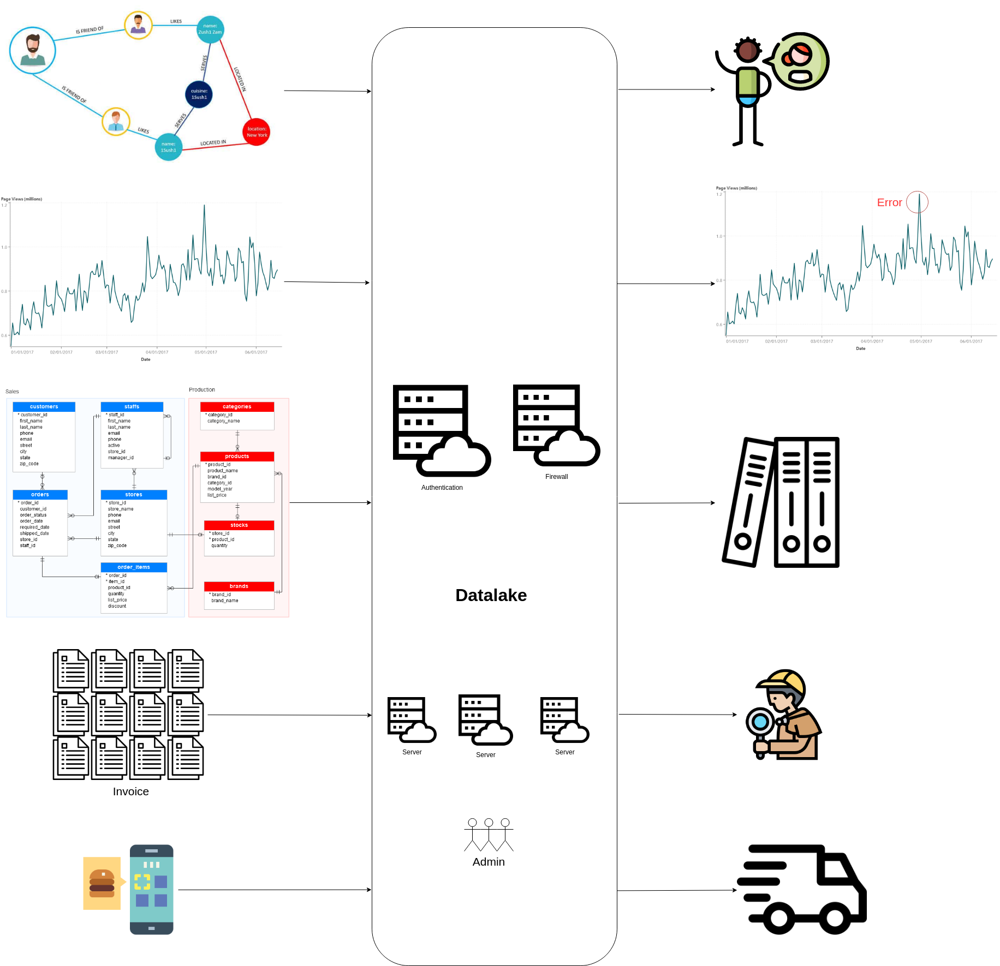
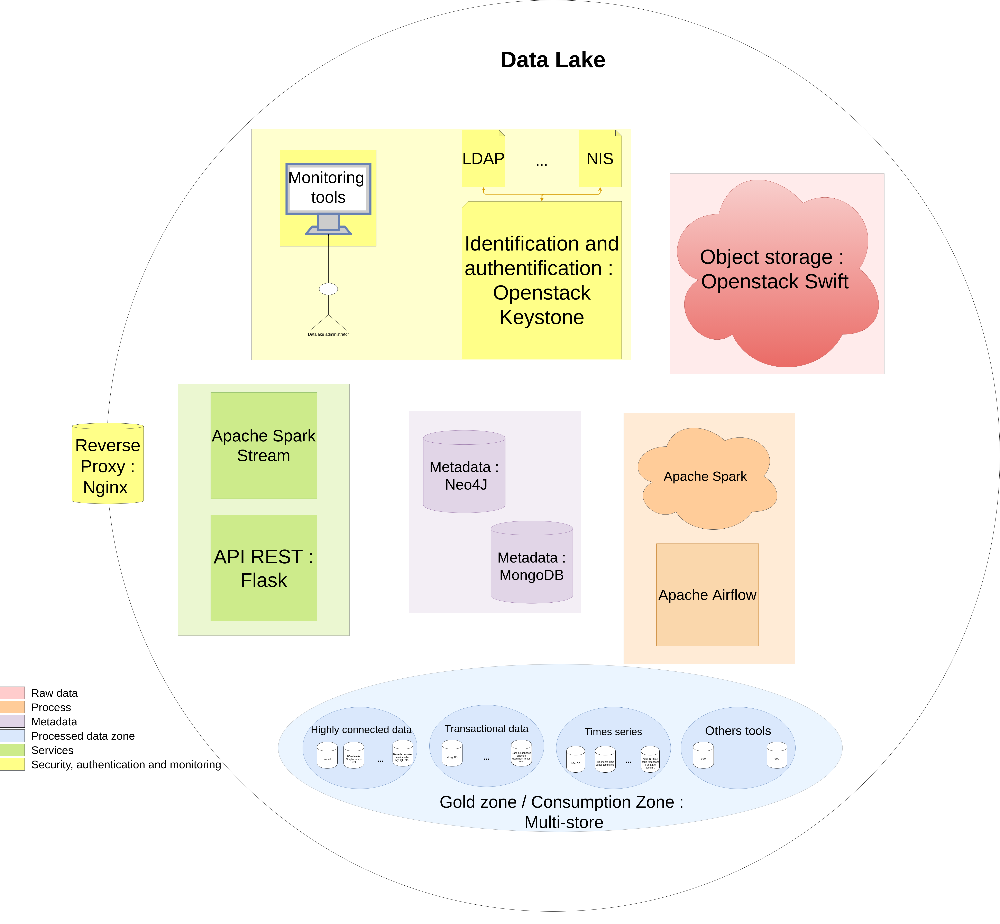
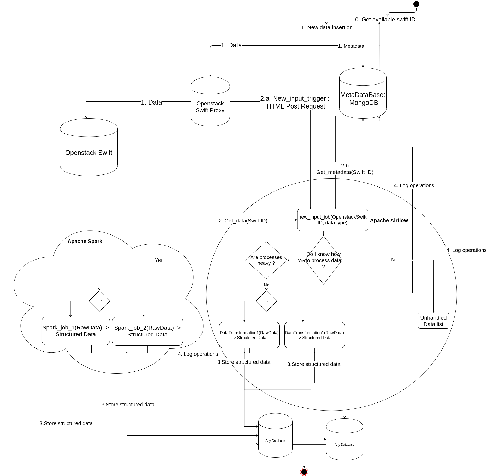
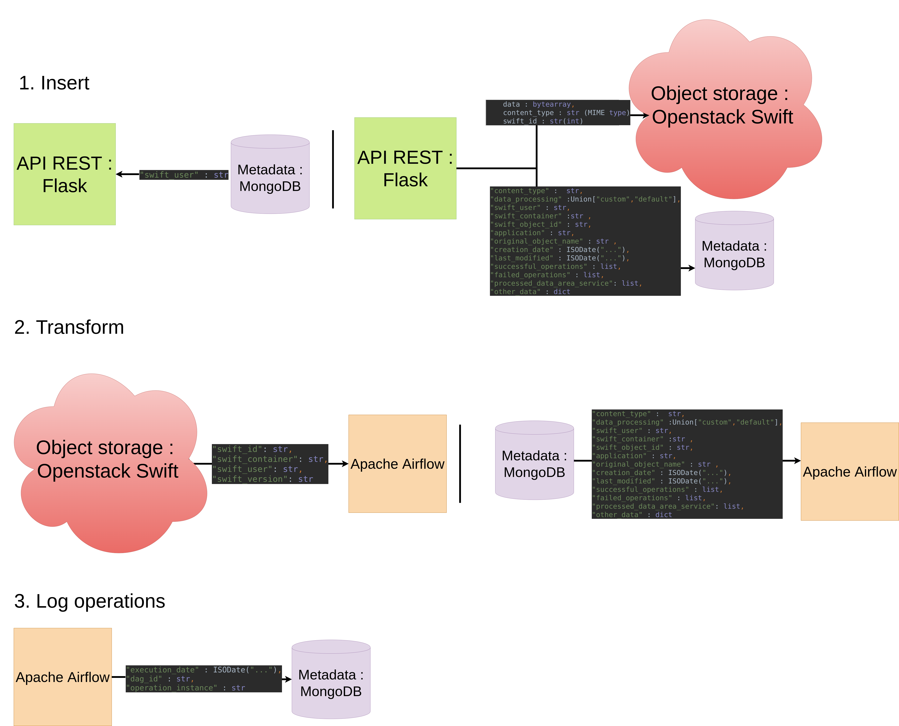

#  The project is now hold on 2 differents repository  
#   The official main repository is the IRIT Gitlab repository (https://gitlab.irit.fr/datalake/docker_datalake).  
#   The secondary repository is the Github initial repository (https://github.com/vincentnam/docker_datalake).  

The github repository is mirorred to follow the progress of the Gitlab repository and to be synchronized.

# Data lake architecture POC hosted on OSIRIM (https://osirim.irit.fr/site/)

This repository is the main working repository for the data lake architecture.
The goals are : 
- Create an opensource architecture for data management based on data lake architecture
- Handle any type of data 
- Handle any volumetry of datas
- Make it easy to deploy the architecture
- Make an interoperable architecture through the usage of REST API whenever it is possible 

The development of this architecture will integrate a semantic dimension in the development of services and features.

## Table of content 

- [Datalake concept](#DatalakeConcept)
    * [State of art](#Stateofart)
- [The project : context](#TheProjectContext)
- [The project : design](#TheProjectDesign)
    * [Architecture : Zone-based service-oriented datalake](#CurrentArchitecture)
        + [Raw data management zone (a.k.a. landing area)](#RawDataZone)
        + [Metadata management zone](#MetadataManagementZone)
        + [Process zone](#ProcessZone)
        + [Processed data zone (a.k.a. consumption zone, access zone or gold zone)](#ProcessedDataZone)
        + [Services zone](#Serviceszone)
        + [Security, authentication and monitoring zone](#Securityandmonitoringzone)
    * [Data lifecycle](#DataLifecycle)
        + [Main data life cycle : Batch data](#BatchData)
            - [Light process](#Batchdata_lightprocess)
            - [Heavy process](#Batchdata_heavyprocess)
        + [Extended data life cycle : Stream data](#Streamdata)
    * [Metadata management](#MetadataManagement)
        * [Metadata management system](#MetadataManagementSystem)
            + [Metadata management system : MongoDB](#MetadataMongodb)
        * [Needed metadata](#NeededMetadata)
        * [Optional metadata](#OptionalMetadata)
- [The project : features](#TheProjectFeatures)
    * [Virtualization](#Virtualisation)
        + [Sizing : Kubernetes](#SizingKubernetes)
        + [Automatic deployment with Ansible](#AutomaticDeployment)
    * [Security management](#Security)
        + [Security : by design](#Securitybydesign)
            - [Flow control and networks](#FlowControlAndNetworks)
        + [Security : by tools](#Securitybytools)
            - [Identification : Openstack Keystone](#Keystone)
            - [Authentication : Server Kerberos](#Kerberos)
    * [Monitoring](#Monitoring)
        + [Monitoring : Kubernetes monitoring tools](#MonitoringKubernetes)
        + [Monitoring : low level monitoring : SNMP ](#SNMP)
        + [Monitoring : Openstack Ceilometer](#Ceilometer)
    * [User spaces compartmentalization](#UserSpaceCompartmentalization)
        + [User spaces compartmentalization : Virtualization, Docker and Kubernetes](#UserSpaceCompartmentalizationVirtualisation)
        + [User spaces compartmentalization : Openstack Keystone](#UserSpaceCompartmentalizationKeystone)
    * [Automation, tests, builds](#AutomationTestBuilds)
        + [Automation, tests, builds : CI/CD Pipeline, builds servers](#AutomationTestBuildsCICD )
        + [Automation : Apache Airflow and service lifecheck](#AutomationAirflowLifecheck)
- [Technical description](#TechnicalDescription)
    * [Tool by tool](#ToolByTool)
        + [Airflow](#Airflow)
    * [What has been implemented](#Implemented)
    * [Network description](#NetworkDescription)
        + [TCP Ports used](#TCPPortsused)
        + [API description - TODO](#APIdescrption)
        + [Data exchanges between services](#Dataexchangesbetweenservices)
    * [Data formats](#Dataformats)

        + [Openstack Swift](#OpenstackSwift)
        + [MongoDB metadata database - TO REFACTOR](#MongoDBmetadatadatabase)
- [Getting started](#GettingStarted)
    + [Deployment](#Deployment)
        * [Start Openstack Swift docker container](#StartOpenstackSwiftdockercontainer)
        * [First action to do](#FirstActionToDo)
    + [Usage](#Usage)
        * [Insert a new data](#Insertanewdata)
        * [Process a data already inserted](#Processadataalreadyinserted)
        * [Access to services - TODO](#Accesstoservices)
        * [Deploy the architecture](#Deploythearchitecture)
        * [Create an Airflow job](#CreateanAirflowjob)
        * [Create an Airflow pipeline](#CreateanAirflowpipeline)
        * [Integrate a new process pipeline in Airflow](#IntegrateanewprocesspipelineinAirflow)
- [What's coming up - Roadmap](#Incoming)
    * [TODO : Implementation](#TODOImplementation)
    * [TODO : Design](#TODODesign)
    * [TODO : Documentation](#TODODocumentation)
- [Other information](#OtherInformation)
    * [Problems already encountered](#Problemsalreadyencountered)
        + [MsSQL 20xx](#MsSQL20xx)
        + [Airflow](#AirflowProblem)
    * [Tools not used](#Toolsnotused)
        + [In raw data zone](#InRawDataZone)
        + [In process zone](#Inprocesszone)
        + [In processed data zone](#Inprocesseddatazone)
    * [More documentation](#Moredocumentation)
    * [Versioning rules](#VersioningRules)
    * [Licence](#Licence)
- [Contacts](#Contacts)

# Datalake concept 
[Return to the table of content](#Tableofcontent)

Data-oriented project are most of the time driven by the use case. 
Whether it is for employee data storage, for reporting, for anomaly detection, for application operation, etc.., it requires a specific architecture based on a database.

Those kind of architecture needs to be secured, well dimensioned and administered. 
But if another use case is deployed, the whole process has to be done again for each new use case. It costs time and resources (human and server resources).

The data lake allows to share the whole architecture for security, authentication, server allocation services for any kind of data driven project.
Moreover, the solution proposed here allow to integrate any kind of data management, data analysis or reporting solution in a unique solution.

It reduces costs for **high volumetry** and a **high variety** of data project or companies.
This solution has been designed to integrate solutions that has already been deployed, as authentication systems, database solutions or data analysis solutions. 
The initial resource investment is higher than simple database solution but it is reduced for new other solutions. 

## State of art 
[Return to the table of content](#Tableofcontent)

We base our approach on the expressed needs but also on this scientific paper : https://www.researchgate.net/publication/333653951_Big_data_stream_analysis_a_systematic_literature_review.

##### **COMING SOON**

# The project : context 
[Return to the table of content](#Tableofcontent)

This project is supported by neOCampus, OSIRIM, the CNRS, the IRIT and the SMAC team in IRIT. 

This project has been started with a internship for 2nd year of Master in Statistic and Decisional Computing (SID at Université Toulouse 3 - Paul-Sabatier in Toulouse) funded by neOCampus. 
The project has been continued through a 1year-fixed-term contract by the CNRS and the OSIRIM platform.

- The IRIT ("Institut de Recherche en Informatique de Toulouse" : https://www.irit.fr/) is a french laboratory under the supervision of the CNRS and the Toulouse universities in the field of computer science.
- NeOCampus is an operation based in the University with numerous research laboratory. A big part of the network used in this operation is used by sensors and effector. But we can find a lot of other kind of informations. The goal of this project is to create an architecture of data lake that can handle the needs and the data in neOCampus operation.
- OSIRIM (Observatoire des Systèmes d'Indexation et de Recherche d'Information Multimedia) is one of IRIT's platforms. It is mainly supported by the European Regional Development Fund (ERDF), the French government, the Midi-Pyrénées region and the Centre National de la Recherche Scientifique (CNRS).
- The SMAC team is interested in modeling and problem solving in complex systems using multi-agen technology. ( https://www.irit.fr/departement/intelligence-collective-interaction/equipe-smac/ )

From March 2020 to now : The project is designed, handled, maintained by **[DANG Vincent-Nam](#Contacts)** (for neOCampus / IRIT / OSIRIM / CNRS / Toulouse university).

Beginning 2021 : The project has been joined with a patronage by Modis engineers based on project designed by DANG Vincent-Nam.

# The project : design 
[Return to the table of content](#Tableofcontent)

The design has been done through a service-oriented approach of a theoretical proposal for a zone-based architecture.
Zone defines here a group of services that answer the same need. 

## Current architecture : Zone-based service-oriented datalake 

[Return to the table of content](#Tableofcontent)

The architecture is divided in 6 zones :
- Raw data management zone (also known as the landing area)
- Metadata management zone 
- Process zone
- Processed data zone (also known as the gold zone)
- Services zone
- Security and monitoring zone

### Raw data management zone (a.k.a. landing area) 

[Return to the table of content](#Tableofcontent)

The purpose of this area is to handle, store and make available raw data. Each data is stored as is waiting to be processed and transformed into an information.

This area is the core of the architecture, where every data are stored and every service of this architecture are working on. 
This area is composed by 1 service :
- Openstack swift (https://wiki.openstack.org/wiki/Swift) : 
    - Openstack Swift is a cloud storage software. It is an object-oriented store. It is a part of the Openstack cloud platform deployment and has been built for scale and optimized for durability, availability, and concurrency across the entire data set. 
    - Its role is to store all input data as an object. It can handle any type of file or data of any size. 

With a network-oriented vision, this zone is a buffer zone.
    

### Metadata management zone 
[Return to the table of content](#Tableofcontent)

-> TODO : redesign this area : 
    - Define which metadata to keep in which service (i.e. at the moment, it should be : models (i.e. links betweens metadata in neo4j) and metadata in mongodb)
    - Seems to be more collections in Mongodb for each type of document 

- MongoDB (https://www.mongodb.com/) :
    - Document oriented NoSQL database. It has been built as a NoSQL database made for high volumetry input. 
    - Its role is to store meta data over the data inserted in Openstack Swift and to make it possible to follow and store data over data and be able to know what is stored in Openstack Swift.
    - Operations logs ?
- Neo4J (https://neo4j.com)
    - Pipelines / workflows definition
    - Metadata format (class diagram ?)

### Process zone 

[Return to the table of content](#Tableofcontent)

This area is headed by Apache Airflow that will handle and manage every workflow and jobs of data processing and sub services deployed and managed by Apache Airflow :
- Apache Airflow (https://airflow.apache.org/)
    - Job and workflow scheduler application. This service make it possible to schedule and monitor workflows written in Python.
    - Based on direct acyclic graphs, the data life is easily monitored.
    - It process raw data from the raw data management area to the processed data area by applying custom workflows developed by and for users needs. 

- Apache Spark (https://spark.apache.org/): 
    - Used for ressources allocations for data processing on large dataset with high parallelization
    - Used in Lambda or Kappa architecture or real-time data analysis pipeline 
    - **Warning** : some optimizations has to be done to be efficient with Openstack Swift (cf : https://lsds.doc.ic.ac.uk/sites/default/files/swift-analytics_ic2e17_crv.pdf ). In this architecture, we can save file path directly to make it faster in metadata storage (with no overhead as it designed to store this kind of metadata)
    
The deployment of a Hadoop cluster has been thought but the idea could be not implemented or kept. Indeed, hadoop is designed to handle large files and can't handle well small files (cf default block size : 64MB ou 128MB)

### Processed data zone (a.k.a. consumption zone, access zone or gold zone)   

[Return to the table of content](#Tableofcontent)

This area is there to create values over data. Its role is to provide information and allow external application to work on data.
The processed data area is supposed to host any database that is needed by users. 
As no real need have been expressed, no real use case are implemented here. 
But some use cases have been imagined :
- InfluxDB (https://www.influxdata.com/):
    - Time serie oriented database with data visualization tools natively integrated.
    - The purpose of this database is to store formatted sensors readings and make it possible to visualize those data easily.
- Neo4J (https://neo4j.com/): 
    - Graph oriented database with data visualization tools natively integrated.
    - The purpose of this database is to store metadata over blob data (image, sound, video) to create a recommendation system for dataset creation.
- MongoDB (https://www.mongodb.com/):
    - Same database as the metadata database used in the raw data management area.
    - The purpose here is to store data for in-production applications
- SQL Database (MsSQL Server 2017 ?)
    

### Services zone   

[Return to the table of content](#Tableofcontent)

This functional area includes every service to make this platform user-friendly. At this point (23/11/2020), 3 services have been designed :
- Data insertion and download services :
    - Composed with 2 services : web GUI and REST API.
        - The web GUI is based on NodeJS server with a React application for user-friendly data insertion. The data are inserted or shown through a graphical user interface to make it easy to use.
        - The REST API is developed with python Flask API to make it possible to programmatically use the data management services (insert data in raw data management area or download data from processed data area)

- Data stream insertion : 
    - Apache Spark Streaming (https://spark.apache.org/docs/latest/streaming-programming-guide.html): 
        - This library allow to create stream and process theses data with Apache Spark
        - Functionally separated from Apache Spark, it based on Apache Spark and can't work stand alone
    

- Real-time data consumption service :
    - No solution have been found at this point (23/11/2020) to answer this need.
    - The purpose of this service is to make it possible to consume data in a real-time process (initially designed for autOCampus project in neOCampus)

- Streaming data consumption service :
    - No solution have been found at this point (23/11/2020) to answer this need.
    - The purpose of this service is to make it possible to consume data as a stream for application that works in streaming mode. It has been initialy designed for online machine learning application. 

(12/04/2021) Data consumption may be done through RESTful API, direct access to real-time database (InfluxDB as an exemple) or create direct access 

### Security, authentication and monitoring zone    

[Return to the table of content](#Tableofcontent)

The purpose of this area is to make it possible to monitor the whole architecture for administrators and give 3 level monitoring.
The area has to be adapted to the host platform so services could change with deployment.
- First monitoring level : User level
    - Openstack Keystone (https://wiki.openstack.org/wiki/Keystone)
        - This service is here to identify and authenticate users in the architecture.
        - It integrate itself well with Openstack Swift and over other authentication services as LDAP or NIS that allow to maintain pre-existing authentication services. 
- Second monitoring level : Service level
    - Openstack Ceilometer (https://docs.openstack.org/ceilometer/latest/):
        - This service is a telemetry service for Openstack services. 
        - The objective is to monitor services state and usages for sizing in operation.
- Third level : Network and system level
    - SNMP + Zabbix : 
        - SNMP is a standard protocol of network management. It allow us to follow machine resources consumption and network usage.
        - Combine with Zabbix, this is a service of network and system monitoring with graphical user interface.

This area has to be work more to better design it. Prometheus could be used to monitor Network and System level and other services could be used for other levels. 

## Data lifecycle    
[Return to the table of content](#Tableofcontent)

This project is fully placed in the Big data world (see "4 V's of Big data", sometimes 5 or more V are described.). We split the data into 2 distinct groups with distinct goals, perspectives and requirements : 
- Batch data 
- Stream data

Batch data main goal is to be **stored**. Batch data are defined to stay on disk with a long lifespan. Those data will be processed, valuated and consumed on a different timescale than the production.

Stream data main goal is to be **processed**. Stream data are defined to be generated and as quickly as possible processed for consumption. This data is eventually stored to be consumed again later or in another way.

The architecture handle batch data as main goal but it will be enhanced to handle stream data and eventually near-real time data processing, depending on implementation and tools used.

### Main data life cycle : Batch data
[Return to the table of content](#Tableofcontent)

The global data life in this architecture is described in this diagram : 

- First, data are inserted simultaneously in Openstack Swift and MongoDB meta database.
- Then, a webhook is triggered by swift proxy to trigger the Airflow workflow for new data containing metadata over the data inserted.
- Depending on the data type, the user and the user group / project, the data is processed, transformed and inserted in the corresponding database in the processed data area. 
- Every operations are logged in the metadata database.

Batch data can also be split into 2 distinct groups : light process and heavy process. 
The light processes include the reading, formatting processes and all the processed made to make the data available.
Heavy processes are processes which aim to create data from master data such as data mining, data analysis or machine learning.

TODO: Explanation of diagram

### Light process 
[Return to the table of content](#Tableofcontent)

 

1. Data are inserted through API designed in the service zone. All batch data are inserted through the RESTful API. For security reasons, the RESTful API (Flask) is accessible behind an Reverse Proxy. The RESTful API handle insertions of data and metadata (respectively Openstack Swift and Mongodb).
2. Web trigger is raised from the Openstack Swift proxy triggering an Apache Airflow workflow with minimum metadata to retrieve the data. 
3. Apache Airflow workflow process metadata (type, project or every metadata needed to branching through the workflow easily). Data is eventually read from Openstack Swift and each process are logged in metadata zone. 
4. The last step of each workflow has to be the storage of each processed data. Intermediate results could be stored if needed and all the data could even be stored in Openstack Swift.
5. Once the data processed, it can be consumed through the RESTful API from tools in consumptions zone. A direct access could be designed if needed.

#### Heavy process 

[Return to the table of content](#Tableofcontent)

For heavy process, minor differences can be observed in the process area, otherwise no differences exist.  
4. The data is send to Apache Spark cluster. Data are processed in the same way as with Apache Airflow except that resources are allocated by Apache Spark. It can be seen as a tool in Apache Airflow tool box.

### Extended data life cycle : Stream data 
[Return to the table of content](#Tableofcontent)

Stream data pipeline is different as goals are differents. The first step is to define and instantiate the stream. As it is not a step of data input, it is the 0 step.

0. User ou administrator has to create a stream. As we can assume that each data in the stream (especially in IoT) as the same metadata, the metadata are defined 1 time for the whole stream. Each sample will be linked to this metadata. This way, Apache Airflow can instantiate the stream through Apache Spark and Apache Spark Stream. 
    1. Apache Airflow instantiate a stream lifechecker workflow scheduled at regular interval. It will be able to update metadata (exemple : number of samples).

1. The sample is send to Apache Spark Streaming. The sample is directly sent to Apache Spark to be processed as faster as possible.
2. 2 tasks have to be done in parallel. We have to process the data and store it in a consumption tool as the main objective and store it in the raw data storage.
3. This step is depending on the implementation. Indeed, the more secure way is to define consumption through RESTful API (and reverse proxy) but it could be not possible with tools used and a direct access will be needed.

The same pipeline is defined for near-real time but some customization may be needed. Indeed, the time constraint is conditionned by tools performances and tools used. We place ourselves in near real-time, not in real-time or hard real-time. The goal is to consume the data in the same time scale as the production.

## Metadata management 
[Return to the table of content](#Tableofcontent)

TODO : Explanation - Aimed metadata management system - actul : only mongodb

### Metadata management system 
[Return to the table of content](#Tableofcontent)

The metadata is managed in the metadata management system. This system is currently constituted by a NoSQL MongoDB database. 
This system will be enriched later by a Neo4J database (see [What's coming up: metadata management system](#MetadataNeo4J).

The main interest of the MongoDB database is the possibility to have a semi-structured data model allowing the possibility to modify, add and enrich the metadata document without constraints.
There are more than 3000 meta-data models for data description and catalog construction. With the objective of building a data catalog and a data recommendation tool, it is necessary not to restrict to one data format.

#### Metadata management system : MongoDB 
[Return to the table of content](#Tableofcontent)

MongoDB aims to keep the metadata documents of each data and the various histories. It allows to store via its maximum 16 MB of data a large amount of data. Moreover, the primary objective of the database ' 
We can store a large volume of data while allowing efficient search in these data, especially via the query tool that MongoDB offers and an implementation of MapReduce.

2 databases in MongoDB have been created for the functioning of the architecture:
- The "stats" database to keep all the statistics and data needed for the operation of the overall architecture. 
- The "swift" database to keep the metadata associated to each object kept in Openstack Swift

##### Stats database

The "swift" collection contains 1 unique document instantiated at the initialization of the architecture which evolves throughout the operation of the architecture.
This document is built as follows: 
    
    {   
        "_id" : MongoDB default ID, 
        "type" : "object_id_file", 
        "object_id" : last_available_swift_id 
    }

Its purpose is to hold the identifier by which the next data should be renamed.  
Designed as a simple counter at the moment, its purpose is to allow counting of the number of total objects kept. 

This collection can be used to keep other data calculated (or not) on the life statistics of the architecture. 
We can think of : statistics on exchanges, a list of counters or even a list of metadata, search results to accelerate the search of future recommendation tools.

#### Swift database
The "Swift" database is the metadata database of each data. 
Each collection corresponds to a user of the database or a container in Swift.
Each document is built as follows: 
    
    {
     "_id" : MongoDB default ID, 
     "content_type" : type of data / MIME type ,
     "data_processing" : type of data processing in Airflow ("custom" or "default") for pipeline choosing,
     "swift_user" : authenticated user that inserted the data, 
     "swift_container" : Openstack Swift container referring to project / user group,
     "swift_object_id" : id from "object_id_file" in stats database,
     "application" : description of the purpose of the data,
     "original_object_name" : original name ,
     "creation_date" : ISODate("..."),
     "last_modified" : ISODate("..."),
     "successful_operations" : [ ] : list of successful operations done on the data,
     "failed_operations" : [ ] : list of failed operations done on the data, 
     "other_data" : {...} : anything that is needed to know on the data (custom metadata inserted by user) 
    }

#### Needed metadata 
[Return to the table of content](#Tableofcontent)

The required metadata is the metadata that must be filled in to make the architecture work.

| Field | Utility | Filling (automatic / manual) | Editable |
|-------|---------|---------| ---------| 
| _id | MongoDB default identifier. Allows to uniquely identify the document.| Automatic | No | 
| content_type | Data type | Automatic (manual overwrite if needed) | Yes |
| data_processing | Type of service to provide "custom" or "default"; a set of default services is set up to provide a minimum service| Manual (Default: default) | Yes |
| swift_user | User who owns the data, defined as the user who inserts the data | Automatic | Yes | 
| swift_container | swift container in which the data is inserted | Manual | Yes |
| swift_object_id | Unique identifier for objects in Swift | Automatic | No |
| original_object_name | Original name of the data; necessary to rename the data in the upload| Automatic (manual overwriting possible) | Yes |
| creation_date| Date of creation of the object; corresponds to the date of insertion of the data | Automatic | No | 

 
### Optional metadata 
[Return to the table of content](#Tableofcontent)

Optional metadata is metadata that has been added and whose absence does not disrupt the proper functioning of the architecture in a basic utilsiation scenario.

| Field | Utility | Filling (automatic / manual) | Modifiable |
|-------|---------|---------| ---------| 
| last_modified | Last_modified date; allows to follow the life of the data | Automatic | No | 
| successful_operations | List of successful operations on the data; allows to follow the life of the data| Automatic | No | 
| failed_operations | List of failed operations; allows to follow the life of the data| Automatic | No | 
| application | Textual description of the data| Manual | Yes | 
| Other_data | JSON document / Dictionary to add additional metadata in key/value format | Manual | Yes | 

# The project : features 
[Return to the table of content](#Tableofcontent)

TODO 

## Virtualization 
[Return to the table of content](#Tableofcontent)

TODO 

### Sizing : Kubernetes 
[Return to the table of content](#Tableofcontent)

TODO 

### Automatic deployment with Ansible 
[Return to the table of content](#Tableofcontent)

TODO 

## Security management 
[Return to the table of content](#Tableofcontent)

TODO 

### Security : by design 
[Return to the table of content](#Tableofcontent)

TODO 

#### Flow control and networks 
[Return to the table of content](#Tableofcontent)

TODO 

### Security : by tools 
[Return to the table of content](#Tableofcontent)

TODO 

#### Identification : Openstack Keystone 
[Return to the table of content](#Tableofcontent)

TODO 

#### Authentication : Server Kerberos 
[Return to the table of content](#Tableofcontent)

TODO 

## Monitoring 
[Return to the table of content](#Tableofcontent)

TODO 

### Monitoring : Kubernetes monitoring tools 
[Return to the table of content](#Tableofcontent)

TODO 

### Monitoring : low level monitoring : SNMP  
[Return to the table of content](#Tableofcontent)

TODO 

### Monitoring : Openstack Ceilometer 
[Return to the table of content](#Tableofcontent)

TODO 

## User spaces compartmentalization 
[Return to the table of content](#Tableofcontent)

TODO 

### User spaces compartmentalization : Virtualization, Docker and Kubernetes 
[Return to the table of content](#Tableofcontent)

TODO 

### User spaces compartmentalization : Openstack Keystone 
[Return to the table of content](#Tableofcontent)

TODO 

## Automation, tests, builds 
[Return to the table of content](#Tableofcontent)

TODO 

### Automation, tests, builds : CI/CD Pipeline, builds servers 
[Return to the table of content](#Tableofcontent)

TODO 

### Automation : Apache Airflow and service lifecheck 
[Return to the table of content](#Tableofcontent)

TODO 

# Technical description 

[Return to the table of content](#Tableofcontent)

- MongoDb (Metadata system)
- Openstack Swift (Raw data storage)
- Apache Airflow (Process scheduler)
- Neo4J (Processed data database)
- Influxdb (Processed data database)
- NodeJS (Service)
- React (Service)
- Flask (Service)
- Microsoft Server SQL 2017 (Processed data database) 

## Tool by tool 
[Return to the table of content](#Tableofcontent)

TODO 

### Airflow 
[Return to the table of content](#Tableofcontent)

Aiflow DAG tools in the apache_airflow/dag/lib folder has a special nomenclature : 
- *tools : all the tools from a database or to process a specific data type 
- *integrator : implemented tool to put data into a specific database 

TODO : REWORK THE WHOLE PROCESS DEFINITION

## What has been implemented 
[Return to the table of content](#Tableofcontent)

The project has been tested through a Proof of Concept hosted on Osirim and hosted on several VM on a VM Ware virtualization server. 
Each service has its own virtual machine except for access zone databases that are all hosted on the same VM.
Data storage is made on a NFS bay. Only 2 users are allowed to access this network with SSH. 
At this point (23/11/2020), the POC is not adapted for this platform and wont be deployed in a production state on OSIRIM.

## Network description 
[Return to the table of content](#Tableofcontent)

TODO : Explnanation - 6 differents networks : 1 for each need 

### TCP Ports used 
[Return to the table of content](#Tableofcontent)

Raw data area : 
- 8080 : Swift 
- 27017 : MongoDB metadatabase

Process zone : 
- 8081 : Airflow (Webserver)

Consumption zone : 
- Influxdb ports depends on InfluxDB version used (InfluxDB 2 beta version or RC version)  
    - 9999 : InfluxDB web interface  
    - 8086 : Influxdb web interface

- 7000 :Neo4J
### API description - TODO 
[Return to the table of content](#Tableofcontent)

TODO : Openstack, MongoDB, API Rest for insertion, web gui, etc..
Openstack Swift : REST API (see documentation)
MongoDB : API in several languages (Pymongo in Python as an example)
Airflow : Web server GUI and REST API (see documentation)

### Data exchanges between services 
[Return to the table of content](#Tableofcontent)

Data exchanges at this point are described in the following schema.

TODO : Explanation

#### Defined

TODO : Explanation 

#### Still undefined

TODO : Explanation

## Data formats 
[Return to the table of content](#Tableofcontent)

### Openstack Swift 
[Return to the table of content](#Tableofcontent)

Object inserted in Openstack swift are renamed with a number id. 
This id is incremented by 1 for every object insert. It allows to follow easily the number of object stored in Openstack Swift.

Only the renamed data are store in Openstack swift. Every metadata are stored in the metadata database (MongoDB).
Each object is stored on a container that match to the project or the user group / team.

### MongoDB metadata database - TO REFACTOR 
[Return to the table of content](#Tableofcontent)

(23/11/2020) MongoDB contains :
- "stats" database :
    - "swift" collection : 
        - contains only 1 document : 
            - { "_id" : ..., "type" : "object_id_file", "object_id" : last_available_swift_id }
            - used to rename and follow Swift object id
        - could be used to store other data
- "swift" database :
    - a collection for each project has to be created :
        - contains 1 document for each object. Each document contains : 
            - "_id" : MongoDB default ID , 
            - "content_type" : type of data / MIME type ,
            - "data_processing" : type of data processing in Airflow ("custom" or "default") for pipeline choosing,
            - "swift_user" : authenticated user that inserted the data, 
            - "swift_container" : Openstack Swift container referring to project / user group,
            - "swift_object_id" : id from "object_id_file" in stats database,
            - "application" : description of the purpose of the data,
            - "original_object_name" : original name ,
            - "creation_date" : ISODate("..."),
            - "last_modified" : ISODate("..."),
            - "successful_operations" : [ ] : list of successful operations done on the data,
            - "failed_operations" : [ ] : list of failed operations done on the data, 
            - "other_data" : {...} : anything that is needed to know on the data (custom metadata inserted by user) 
                     

# Getting started 
[Return to the table of content](#Tableofcontent)

## Deployment 
[Return to the table of content](#Tableofcontent)

TODO : Finish ansible, make fully automatic deployment with ansible (see docker branch) 
- docker-compose up 

### Start Openstack Swift docker container 
[Return to the table of content](#Tableofcontent)

TODO : Refactor, update 

    docker build -f ./swift/Ubuntu1604.Dockerfile -t ubuntuswift ./swift/
    docker run -p 8080:8080 --privileged --device /dev/loop0 --device /dev/loop-control -it ubuntuswift

To make data persistant, use docker volume bind 
    
    docker run -p 8080:8080 --privileged --device /dev/loop0 --device /dev/loop-control -v /tmp/dev:/data_dev/1 -it ubuntuswift

The volumes are mounted in /tmp, you have to use a mountable object : dev or loopbackdevice file.

### First action to do 
[Return to the table of content](#Tableofcontent)

Before any insertion, you have to initialize the ID counter by using "init_id(mongodb_url)".

## Usage 
[Return to the table of content](#Tableofcontent)   

### Insert a new data 
[Return to the table of content](#Tableofcontent)   

TODO : Batch and Stream data insertion
###### Batch data
To develop a tool to insert data in the datalake, you have to :
- Get the Swift ID counter and increase it (use "find_one_and_update" to do it with the same operation and reduce chances of data incoherence between 2 instances)
- Construct metadata to store in mongodb (JSON or Python dictionary)
    - content_type : MIME type of the data 
    - swift_user : the swift user that inserted the data
    - swift_container : the swift container where the data is stored
    - swift_object_id : the swift ID given to the data when it has been inserted
    - application : a description of the data usage : the application on which the data is used (optional)
    - swift_object_name : the name of the data (the original name)
    - creation_date : creation date of the document 
    - last_modified : date of the last document modification (and get the last operation date)
    - successful_operations : list of successful operations containing (tuple) :
        - execution_date : 
        - dag_id : The string of "dag_run" instance containing some informing as the dag_id (ex : <DagRun new_input @ 2020-08-04 14:42:38+00:00: 
        test:tester_neocampus_119:2020-08-04T14:42:38, externally triggered: True>") :
            - If the task has been triggered by the proxy-server trigger, it contains :
                - "manual"
                - the date=
            - If the task has been triggered by the "Check_data_to_process" dag, it contains ("%s_%s_%s:%s"): 
                - the user
TODO : Openstack, MongoDB, API Rest for insertion, web gui, etc..
Openstack Swift : REST API (see documentation)
MongoDB : API in several languages (Pymongo in Python as an example)
Airflow : Web server GUI and REST API (see documentation)

                - the container
                - the data swift id
                - the date (datetime)
        - operation_instance : The task id (same format as the dag_id)
    - failed_operations : list of failed operations containing the same as in "successful_operations"
    - other_data : every data that are useful : dictionary 
        - For JSON (jsontools.mongodoc_to_influx()):   
            - template : dictionary for Influxdb to know what field in the json is for : 
                - measurement : str
                - time : datetime 
                - fields : list of couple (key:str ,value : Any)
                - tags : list of couple (key:str ,value: Any)
        - For image JPEG / PNG (neo4jintegrator.insert_image()) : 
            - image_content : every object that are in the image
                - main_object : the main objects in the image
                - secondary_object : object you can see in image in background 
- Check if the swift container exists. If not, creates it.
- Put the data in Swift (with content_type and the swift_id)
- Put the metadata in MongoDB

The "python_test_script.py" is a example script made to add a new data. It has been done to do test but it can be reused to make an insertion script or a REST API.
If you want to insert data in the datalake (a file) : use the "insert_datalake()" function in  ["python_test_script.py"](./python_test_script.py) 

###### Stream data

### Process a data already inserted 
[Return to the table of content](#Tableofcontent)

There is a document in "stats" database in "swift" collection in MongoDB that contains list of data to process that will be check every 5 minutes by "Check_data_to_process" dag. Adding a swift
You'll have to add a document in this list containing : 
- swift_id 
- swift_container
- swift_user
- content_type 

For each data in this list, it will trigger a "new_input" dag to process this data.
DISCLAIMER : "new_input" is actually disable for testing. The actual pipeline is "test" until integration of new pipeline has been done.

### Access to services - TODO 
[Return to the table of content](#Tableofcontent)

### Create an Airflow job 
[Return to the table of content](#Tableofcontent)

Jobs (or tasks) are done through Operators in Airflow (https://airflow.apache.org/docs/apache-airflow/1.10.14/concepts.html#concepts-operators). The definition of a job or a task is done through a python script.
To create a task that will fit in one or more pipeline, an operator has to be used which are defined in the Airflow package.
Several operators exists and each one is used for a specific use, including : 
- BashOperator - executes a bash command
- PythonOperator - calls an arbitrary Python function
- EmailOperator - sends an email
- SimpleHttpOperator - sends an HTTP request
- MySqlOperator, SqliteOperator, PostgresOperator, MsSqlOperator, OracleOperator, JdbcOperator, etc. - executes a SQL command
- Sensor - an Operator that waits (polls) for a certain time, file, database row, S3 key, etc…
In addition to these basic building blocks, there are many more specific operators: DockerOperator, HiveOperator, S3FileTransformOperator, PrestoToMySqlTransfer, SlackAPIOperator…
(Cf. Airflow documentation)

The python operator may be the most useful. To use it, there are 2 steps to follow : 
- First, create the python function to be done by the task, example : 

<b></b>

    def print_context(ds, **kwargs):
    print(ds)
    return 'Whatever you return gets printed in the logs'
    
- Then, define an operator that will run this function. You have to define the DAG (Directed Acyclic Graph) in which the task will be run but each function can be reused in another Operator.

<b></b>

    run_this = PythonOperator(
        task_id='print_the_context',
        provide_context=True,
        python_callable=print_context,
        dag=dag,
    )

A context can be provided with PythonOperator (always provided in version 2.0) that will allow to give arguments to the function through the **kwargs dict. You can use it as a dictionary and create new keys to provide the data you need. 
This dictionary contains already a lot of information over the dag run (date, id, etc...) but also contains a "ti" or a "task_instance" (depends on .. ?) key that contains the XCom (for cross-communication) object that allow to pull and push information or objects.
- You can push data to pass it to another task 

<b></b>
        
    kwargs['task_instance'].xcom_push(key="thekey",value="thevalue"))
<b>OR </b>

    kwargs["key"] = value
    
- You can pull data from previous task from its return or from a xcom_pull() 

<b></b>

    
    kwargs['task_instance'].xcom_pull(task_ids='ID_OF_THE_TASK') 
<b>OR </b>

    kwargs['ti'].xcom_pull(task_ids='ID_OF_THE_TASK')

Look at the documentation for more information (https://airflow.apache.org/docs/apache-airflow/1.10.14/).

### Create an Airflow pipeline 
[Return to the table of content](#Tableofcontent)

Airflow is based on DAG (Directed Acyclic Graph) to implement pipeline / workflows (http://airflow.apache.org/docs/apache-airflow/1.10.14/concepts.html#dags). The definition of a pipeline / workflow is done through a python script
The definition of a pipeline is quite straight forward :
- Define a DAG object 

<b></b>
    
    default_args = {
        'start_date': datetime(2016, 1, 1),
        'owner': 'airflow'
    }
    
    dag = DAG('my_dag', default_args=default_args)

The DAG can be customized with parameters.

- Define the relation between task in your dags.

<b></b>    
    
    task_1 = DummyOperator('task_1', dag=dag)
    task_2 = DummyOperator('task_2', dag=dag)
    task_1 >> task_2 # Define dependencies

The "task_2" will be linked to "task_1" and will be run after it. Each task can be define with a run condition (as "all_success", "all_failed", "at least 1 task is successful", etc..).
It is possible to create several branches to make several way for processing. The tools used for it are branching operators (see https://airflow.apache.org/docs/apache-airflow/1.10.14/concepts.html#branching)
Branching is done the same way but you can link a list of task to branch it. The branching will have to return the task name of the next task to run.

    
    branch_operator >> [way_1 , way_2] 

### Integrate a new process pipeline in Airflow 
[Return to the table of content](#Tableofcontent)

04/01/2021 : 
Right now, it is not possible to easily add a pipeline or a task in Airflow.
The way to do it is to change the actual working pipeline. Indeed, only one is triggered by the Openstack Swift proxy when a new data is added. 

To add a task or a sub-pipeline / sub-workflow, it will be needed to modify the "./apache_airflow/dags/dag_creator.py" (at the end of the script) and modify the "custom path" in the dag:

    custom >> [the_first_task_of_the_sub_pipeline]
    the_first_task_of_the_sub_pipeline >> ... >> join
    
TODO : Add a way to read and parse files in directory and create jobs and dags in function of the content.

For the implementation on OSIRIM, as access are restricted, the best way to add pipeline is to create a python script with : 
- all the functions and the task with operators written in the same file
- create a dummy DAG (optional)
- link all the task (eventually with branching)  

The new pipeline will be added in the "custom" branch as a new way.
Tasks have to be named but 2 tasks have to have different name. The naming convention will be : 

    PROJECT_USER_TASKNAME

with PROJECT the name of the project or the team in which you work in / with, USER is your username, 
TASKNAME is a string that quickly describe the task (example : data_cleaning, feature_extraction, etc...).
It will be easy and fast to integrate the new pipeline.

# What's coming up - Roadmap 
[Return to the table of content](#Tableofcontent)

## TODO : Implementation 
[Return to the table of content](#Tableofcontent)

TODO list for the project development (i.e. the datalake architecture)
TODO : Update TODO list
- [x]  Raw data mangement area : 
    - [x] Batch mode for data insertion
        - [x] API Rest 
            - [x] Make available the data input
            - [X] API Rest to input 1 or more data
        - [x] Object storage : Openstack swift 
            - [x] Unittest : OK 
            - [x] Functionaltest : OK 
                - Ran: 950 tests in 571.0000 sec.
                    - Passed: 883
                    - Skipped: 67
                    - Expected Fail: 0
                    - Unexpected Success: 0
                    - Failed: 0
                    - Sum of execute time for each test: 502.9311 sec.
        - [x] MongoDb database for metadata
            - [ ] Replication for single point of failure problem (REALLY IMPORTANT ! -> if MongoDB datas are corrupted, all data in the datalake are useless)  
        - [x] Trigger for new input to launch a new Airflow job
            - [x] Create middleware for swift proxy (Webhook trigger to launch Airflow jobs)
            - [ ] Use X-Webhook in Swift (secure way)
            - [ ] Optimizations
- [x]  The process area
    - [ ] Upgrade to version 2.0 (stable) if possible
    - [x] Airflow deployment (docker image) 
        - [x] Docker image 
        - [x] Installation on VM
        - [x] Resources allocation 
            - [x] Parallel executor
            - [ ] Kubernetes executor
    - [x] Airflow job creation / configuration 
        - [x] Handle hook from Swift middleware (Webhook)
        - [x] Set up jobs 
    - [ ] Find a proper way to add new task / pipeline ( dag from JSON file ?) 
- [x] The processed data area / the gold zone : 
    - [ ] Relational database (default)
    - [x] Time serie oriented database (visualisation)
        - [x] Json data :
            - [x] Based on templates given (as an input in metadatabase) 
    - [x] Document oriented database (transactional vision)
    - [x] Graph database 
        - [x] Image files : 
            - [x] Jpeg 
                - [x] Nodes creation for objects in the file
                - [ ] Automatic object detection / segmentation 
        - [ ] Recommendation tool
    
- [x] The services area : 
    - [x] RESTFUL API for data insertion and download
        - [x] Python api with Flask 
            - [x] Insertion
            - [x] Download data from database in processed data area
            - [ ] Download data from raw data management area
        - [ ] Rework with platform update (see [Modis](#) branch, projects and issues)
    - [ ] Web GUI for data insertion and data visualization
        - [x] Dashboard creation
        - [x] Data download with React + Express backend server
            - [x] Drag'n'drop insertion 
            - [x] Progress bar
            - [ ] Handle SLO Openstack Swift insertion (Static Large Object) for > 1 Go files
        - [x] Data visualization with React + D3.JS
            - [x] Basic time series visualization
            - [x] Basic graph visualization
            - [ ] Complex visualization from several different databases
        - [ ] Beautiful dashboard development
    - [ ] Real-time data consumption
    - [ ] Streaming data consumption

- [x] Set up a "log" database to log operations on data done
    - [x] Operations are logged in MongoDB MetaDataBase : successful and failed operation (Airflow task + id ) + operations per day

- [ ] Security, Authentication and Monitoring zone
      - [ ] Add Keystone as authentication service
  - [ ] Integrate LDAP
  - [ ] Integrate NIS
    
- [ ] Stream mode : 
    - [ ] Deploy Apache Spark
    - [ ] Deploy Apache Spark Stream
    - [ ] Add stream creation in REST API

- [ ] [AutomaticDeployment](#TODO:AutomaticDeployment) : Docker + Kubernetes + Ansible -> see merge_feature branch 
    - [ ] Docker
        - [ ] MongoDB enterprise container
        - [ ] Openstack Swift container
        - [ ] Apache Airflow container
        - [ ] Processed data zone container (InfluxDB, SQL database)
        - [ ] (NEEDED : Security design and implementation) Openstack Keystone container
        - [ ] (NEEDED : Process zone design and rework : add Apache Spark) Apache Spark container
    - [ ] Kubernetes
        - [ ] Apache Spark cluster on kubernetes design  
        - [ ] ...
    - [ ] Ansible
        - [ ] ...

## TODO : Design 
[Return to the table of content](#Tableofcontent)

- [ ] Add metadata over transformed data in the goldzone (and be able to find the list of process done to create this processed data)

- [ ] Design metadata model
    - [ ] Data lifecycle metadata 
    - [ ] Design metadata model for data
        - [ ] Data type
    - [ ] Redesign logs data
    - [ ] Stream metamodel 
- [ ] Security and monitoring area (REQUIRED : [AutomaticDeployment](#TODO:AutomaticDeployment) ) 
    - [ ] Design security services  
    - [ ] Design monitoring services :
        - [ ] Low level monitoring (network)
        - [ ] Mid level monitoring (process)
        - [ ] High level monitoring (user consumption)    
- [x] API REST 
    - [ ] Add new job
    - [ ] Create new stream
    
- [x] Streaming mode for data insertion
    - [ ] Stream creation handling 
## TODO : Documentation 
[Return to the table of content](#Tableofcontent)

- [ ] Set SSPL license
- [ ] Fill empty sections 

# Other information 
[Return to the table of content](#Tableofcontent)

## Problems already encountered 
[Return to the table of content](#Tableofcontent)

### MsSQL 20xx 
[Return to the table of content](#Tableofcontent)

The Microsoft Server SQL 20xx (i.e. 2017 or 2019) are deployed through Docker container. A password is needed to set up the database which come from :
- Environment with a variable
- Parameter given to the container when the container is ran
- A hidden file ".env" in the host folder containing environment variables 

**If this password is not set, the container will crash on boot.**

### Airflow 

Dont name your task the same name of the callable (python function) : it will lead to an error
    

## Tools not used 
[Return to the table of content](#Tableofcontent)

### In raw data zone 
[Return to the table of content](#Tableofcontent)

-  HBase : need for raw input data, HBase would have been used as a key / value database while it's a column store database + difficult to handle raw data reading
- Apache Nifi : not usefull and doesn't fit in the architecture and replaced with Apache Spark with Apache Spark Stream and MQTT
- Apache Kafka : As MQTT and Apache Spark Stream are / will be used, Apache Kafka isn't needed anymore.

### In process zone 
[Return to the table of content](#Tableofcontent)

-  Talend : difficulties to install on Linux + difficulties to find version that can be integrated in the POC

### In processed data zone 
[Return to the table of content](#Tableofcontent)

Nothing at this moment.

## More documentation 
[Return to the table of content](#Tableofcontent)

Other markdown files are in folder of each service containing some more information over the service.
A pdf is available in the repository. This pdf contains the internship report that I made for the internship. 
It is mainly made of design thinking.

Tools used in this architecture also have documentation :
- Airflow https://airflow.apache.org/docs/ 
- Openstack Swift  https://wiki.openstack.org/wiki/Swift

## Versioning Rules 
[Return to the table of content](#Tableofcontent)

Versions are defined like this : X.Y.Z-a
X : Major (integer)
Y : Minor (integer)
Z : Build (integer)
a : Patches (letter) 

08/06/2021 : 
Major : 1.0.0 will be released with a production-ready solution with tests : 
- [ ] Security is enabled with Openstack Keystone 
- [ ] Automatic deployment, Docker and Kubernetes 
- [ ] First version of web GUI 
- [ ] Minimum service with processes and Apache Spark are deployed
- [ ] Stream data handled
- [ ] Metadata management system with neo4J ready for a better metamodel 
- [ ] Monitoring tools deployed for administration at least (optional)

2.0.0 will be focused on metadata management. (TODO)

Minor : each minor are released when a project is ended :
- [ ] Minimum service in Apache Airflow for some data types (STARTED)
- [ ] Apache Spark and Apache Spark Stream with integration with Apache Airflow
- [ ] Web GUI first version with insertion, download and first data visualization tools (STARTED)
- [ ] Openstack Keystone and integration in other services 
- [ ] Metadata management system improvement (STARTED)
- [ ] Monitoring tools (optional)

Build : each build define a sprint or a (bunch of) feature(s) developped. 

Patches : for a bug fix

## License 
[Return to the table of content](#Tableofcontent)

The whole project is (C) 2020 March, DANG Vincent-Nam <dang.vincent-nam@gmail.com>

for Université Toulouse 3 Paul-Sabatier (FRANCE), IRIT and SMAC Team, neOCampus (during an end of study internship)

and for CNRS (as a 1-year fixed-term contract)

as original designer and developer of the project / solution / architecture and

is licensed under the SSPL, see `https://www.mongodb.com/licensing/server-side-public-license'.

## Contacts 
[Return to the table of content](#Tableofcontent)

04/01/2021 : 

DANG Vincent-Nam (Repository owner, intern and engineer working on the project)

Vincent-Nam.Dang@irit.fr / dang.vincentnam@gmail.com 

https://www.linkedin.com/in/vincent-nam-dang/  

