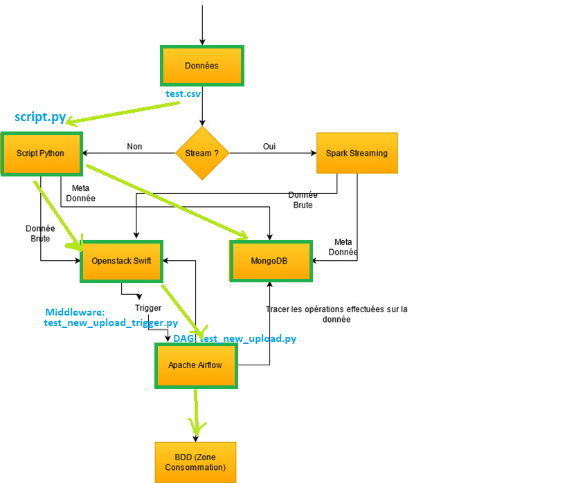

# Testing Modis Cloud Platform

Here are some test scripts for testing modiscloud azure platform

#### main python script

> [script.py](script.py)

#### Swift

a test Swift Middleware (airflow trigger) (**Python3**):
> [swift/test_new_upload_trigger.py](swift/test_new_upload_trigger.py)

copy the proxy-server config file from the docker container

```
docker cp swift:/etc/swift/proxy-server.conf .
```

set the test trigger in `proxy-server.conf`

```
[pipeline:main]
# Yes, proxy-logging appears twice. This is so that
# middleware-originated requests get logged too.
pipeline = catch_errors gatekeeper healthcheck proxy-logging cache etag-quoter listing_formats bulk tempurl ratelimit crossdomain container_sync tempauth staticweb copy container-quotas account-quotas slo dlo versioned_writes symlink test_new_upload_trigger proxy-logging proxy-server

[filter:test_new_upload_trigger]
paste.filter_factory = swift.common.middleware.test_new_upload_trigger:test_new_upload_trigger_factory

```

update Swift `docker-compose.yml`

```
volumes:
      - ./dev/1:/data_dev/1
      - ./dev/2:/data_dev/2
      - ./swift/proxy-server.conf:/etc/swift/proxy-server.conf
      - ./test_new_upload_trigger.py:/usr/local/src/swift/swift/common/middleware/test_new_upload_trigger.py
```

References:

https://docs.openstack.org/swift/latest/development_middleware.html

#### Airflow

a test DAG:
> [airflow/dags/test_new_upload.py](airflow/dags/test_new_upload.py)

copy the airflow config file from the docker container

```
docker cp airflow_airflow-webserver_1:/opt/airflow/airflow.cfg .
```

in the config file `airflow.cfg` change `auth_backend` from `airflow.api.auth.backend.deny_all`
to `airflow.api.auth.backend.basic_auth`

Update Airflow `docker-compose.yml`

```
volumes:
    - ./dags:/opt/airflow/dags
    - ./logs:/opt/airflow/logs
    - ./plugins:/opt/airflow/plugins
    - ./airflow.cfg:/opt/airflow/airflow.cfg
```

References:

https://airflow.apache.org/docs/apache-airflow/stable/tutorial.html

https://airflow.apache.org/docs/apache-airflow/stable/stable-rest-api-ref.html#tag/DAGRun

test connection config file:
> [config.yml](config.yml)

a test csv file:
> [data/test.csv](data/test.csv)

The process is as follows:

1. get the test csv file
2. insert meta data in mongodb
3. upload file content to swift
4. swift trigger airflow task
5. airflow run the DAG, get the swift context and process the data
   

PS:  For security reasons, please replace `127.0.0.1` in the test scripts to the IP addresses of the servers on
modiscloud